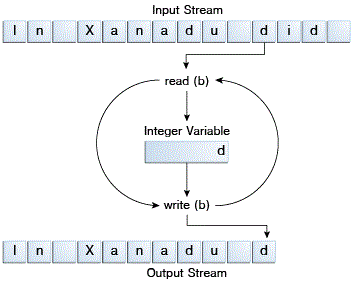
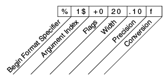
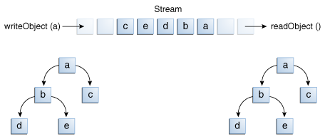

# I/O 流

## 字节流(Byte Streams)

字节流处理原始的二进制数据 I/O。输入输出的是8位字节，相关的类为 [InputStream](https://docs.oracle.com/javase/8/docs/api/java/io/InputStream.html) 和 [OutputStream](https://docs.oracle.com/javase/8/docs/api/java/io/OutputStream.html).

字节流的类有许多。为了演示字节流的工作，我们将重点放在文件 I/O字节流 [FileInputStream](https://docs.oracle.com/javase/8/docs/api/java/io/FileInputStream.html) 和 [FileOutputStream](https://docs.oracle.com/javase/8/docs/api/java/io/FileOutputStream.html) 上。其他种类的字节流用法类似，主要区别在于它们构造的方式，大家可以举一反三。

### 用法

下面一例子 CopyBytes， 从 xanadu.txt 文件复制到 outagain.txt，每次只复制一个字节：

```java
public class CopyBytes {
	/**
	 * @param args
	 * @throws IOException
	 */
	public static void main(String[] args) throws IOException {
		FileInputStream in = null;
		FileOutputStream out = null;

		try {
			in = new FileInputStream("resources/xanadu.txt");
			out = new FileOutputStream("resources/outagain.txt");
			int c;

			while ((c = in.read()) != -1) {
				out.write(c);
			}
		} finally {
			if (in != null) {
				in.close();
			}
			if (out != null) {
				out.close();
			}
		}
	}
}
```

CopyBytes 花费其大部分时间在简单的循环里面，从输入流每次读取一个字节到输出流，如图所示：




### 记得始终关闭流

不再需要一个流记得要关闭它，这点很重要。所以，CopyBytes 使用 finally 块来保证即使发生错误两个流还是能被关闭。这种做法有助于避免严重的资源泄漏。

一个可能的错误是，CopyBytes 无法打开一个或两个文件。当发生这种情况，对应解决方案是判断该文件的流是否是其初始 null 值。这就是为什么 CopyBytes 可以确保每个流变量在调用前都包含了一个对象的引用。

### 何时不使用字节流

CopyBytes 似乎是一个正常的程序，但它实际上代表了一种低级别的 I/O，你应该避免。因为 xanadu.txt 包含字符数据时，最好的方法是使用字符流，下文会有讨论。字节流应只用于最原始的 I/O。所有其他流类型是建立在字节流之上的。

## 字符流(Character Streams)

字符流处理字符数据的 I/O，自动处理与本地字符集转化。

Java 平台存储字符值使用 Unicode 约定。字符流 I/O 会自动将这个内部格式与本地字符集进行转换。在西方的语言环境中，本地字符集通常是 ASCII 的8位超集。

对于大多数应用，字符流的 I/O 不会比 字节流 I/O操作复杂。输入和输出流的类与本地字符集进行自动转换。使用字符的程序来代替字节流可以自动适应本地字符集，并可以准备国际化，而这完全不需要程序员额外的工作。

如果国际化不是一个优先事项，你可以简单地使用字符流类，而不必太注意字符集问题。以后，如果国际化成为当务之急，你的程序可以方便适应这种需求的扩展。见[国际化](http://docs.oracle.com/javase/tutorial/i18n/index.html)获取更多信息。

### 用法

字符流类描述在  [Reader](https://docs.oracle.com/javase/8/docs/api/java/io/Reader.html) 和 [Writer](https://docs.oracle.com/javase/8/docs/api/java/io/Writer.html)。而对应文件 I/O ，在 [FileReader](https://docs.oracle.com/javase/8/docs/api/java/io/FileReader.html) 和 [FileWriter](https://docs.oracle.com/javase/8/docs/api/java/io/FileWriter.html)，下面是一个 CopyCharacters 例子：

```java
public class CopyCharacters {
	/**
	 * @param args
	 * @throws IOException 
	 */
	public static void main(String[] args) throws IOException {
        FileReader inputStream = null;
        FileWriter outputStream = null;

        try {
            inputStream = new FileReader("resources/xanadu.txt");
            outputStream = new FileWriter("resources/characteroutput.txt");

            int c;
            while ((c = inputStream.read()) != -1) {
                outputStream.write(c);
            }
        } finally {
            if (inputStream != null) {
                inputStream.close();
            }
            if (outputStream != null) {
                outputStream.close();
            }
        }
	}
}
```

CopyCharacters 与 CopyBytes 是非常相似的。最重要的区别在于 CopyCharacters  使用的 FileReader 和 FileWriter 用于输入输出，而 CopyBytes 使用 FileInputStream 和FileOutputStream 中的。请注意，这两个CopyBytes和CopyCharacters使用int变量来读取和写入；在 CopyCharacters，int 变量保存在其最后的16位字符值;在 CopyBytes，int 变量保存在其最后的8位字节的值。

#### 字符流使用字节流

字符流往往是对字节流的“包装”。字符流使用字节流来执行物理I/O，同时字符流处理字符和字节之间的转换。例如，FileReader 使用 FileInputStream，而 FileWriter使用的是 FileOutputStream。

有两种通用的字节到字符的“桥梁”流：InputStreamReader 和 OutputStreamWriter。当没有预包装的字符流类时，使用它们来创建字符流。在 [socket](socket.md) 章节中将展示该用法。

### 面向行的 I/O

字符 I/O 通常发生在较大的单位不是单个字符。一个常用的单位是行：用行结束符结尾。行结束符可以是回车/换行序列（“`\r\n`”），一个回车（“`\r`”），或一个换行符（“`\n`”）。支持所有可能的行结束符，程序可以读取任何广泛使用的操作系统创建的文本文件。

修改 CopyCharacters 来演示如使用面向行的 I/O。要做到这一点，我们必须使用两个类，[BufferedReader](https://docs.oracle.com/javase/8/docs/api/java/io/BufferedReader.html) 和 [PrintWriter](https://docs.oracle.com/javase/8/docs/api/java/io/PrintWriter.html) 的。我们会在缓冲 I/O 和Formatting 章节更加深入地研究这些类。

该 CopyLines 示例调用 BufferedReader.readLine 和 PrintWriter.println 同时做一行的输入和输出。

```java
public class CopyLines {
	/**
	 * @param args
	 * @throws IOException 
	 */
	public static void main(String[] args) throws IOException {
		BufferedReader inputStream = null;
        PrintWriter outputStream = null;

        try {
            inputStream = new BufferedReader(new FileReader("resources/xanadu.txt"));
            outputStream = new PrintWriter(new FileWriter("resources/characteroutput.txt"));

            String l;
            while ((l = inputStream.readLine()) != null) {
                outputStream.println(l);
            }
        } finally {
            if (inputStream != null) {
                inputStream.close();
            }
            if (outputStream != null) {
                outputStream.close();
            }
        }
	}
}
```

调用 readLine 按行返回文本行。CopyLines 使用 println 输出带有当前操作系统的行终止符的每一行。这可能与输入文件中不是使用相同的行终止符。

除字符和行之外，有许多方法来构造文本的输入和输出。欲了解更多信息，请参阅 Scanning 和 Formatting。

## 缓冲流（Buffered Streams）

缓冲流通过减少调用本地 API 的次数来优化的输入和输出。

目前为止，大多数时候我们到看到使用非缓冲 I/O 的例子。这意味着每次读或写请求是由基础 OS 直接处理。这可以使一个程序效率低得多，因为每个这样的请求通常引发磁盘访问，网络活动，或一些其它的操作，而这些是相对昂贵的。

为了减少这种开销，所以 Java 平台实现缓冲 I/O 流。缓冲输入流从被称为缓冲区（buffer）的存储器区域读出数据;仅当缓冲区是空时，本地输入 API 才被调用。同样，缓冲输出流，将数据写入到缓存区，只有当缓冲区已满才调用本机输出 API。

程序可以转换的非缓冲流为缓冲流，这里用非缓冲流对象传递给缓冲流类的构造器。

```java
inputStream = new BufferedReader(new FileReader("xanadu.txt"));
outputStream = new BufferedWriter(new FileWriter("characteroutput.txt"));
```

用于包装非缓存流的缓冲流类有4个：[BufferedInputStream](https://docs.oracle.com/javase/8/docs/api/java/io/BufferedInputStream.html) 和 [BufferedOutputStream](https://docs.oracle.com/javase/8/docs/api/java/io/BufferedOutputStream.html) 用于创建字节缓冲字节流, [BufferedReader](https://docs.oracle.com/javase/8/docs/api/java/io/BufferedReader.html) 和 [BufferedWriter](https://docs.oracle.com/javase/8/docs/api/java/io/BufferedWriter.html) 用于创建字符缓冲字节流。

### 刷新缓冲流

刷新缓冲区是指在某个缓冲的关键点就可以将缓冲输出，而不必等待它填满。

一些缓冲输出类通过一个可选的构造函数参数支持 autoflush（自动刷新）。当自动刷新开启，某些关键事件会导致缓冲区被刷新。例如，自动刷新 PrintWriter 对象在每次调用 println 或者 format 时刷新缓冲区。查看 Formatting 了解更多关于这些的方法。

如果要手动刷新流，请调用其 flush 方法。flush 方法可以用于任何输出流，但对非缓冲流是没有效果的。

## 扫描（Scanning）和格式化（Formatting）

扫描和格式化允许程序读取和写入格式化的文本。

I/O 编程通常涉及对人类喜欢的整齐的格式化数据进行转换。为了帮助您与这些琐事，Java 平台提供了两个API。[scanning](http://docs.oracle.com/javase/tutorial/essential/io/scanning.html) API 使用分隔符模式将其输入分解为标记。[formatting](http://docs.oracle.com/javase/tutorial/essential/io/formatting.html) API 将数据重新组合成格式良好的，人类可读的形式。

### 扫描

#### 将其输入分解为标记

默认情况下，Scanner 使用空格字符分隔标记。（空格字符包括空格，制表符和行终止符。为完整列表，请参阅 [Character.isWhitespace](https://docs.oracle.com/javase/8/docs/api/java/lang/Character.html#isWhitespace-char-)）。示例 ScanXan 读取  xanadu.txt 的单个词语并打印他们：

```java
public class ScanXan {
	/**
	 * @param args
	 * @throws IOException 
	 */
	public static void main(String[] args) throws IOException {
		Scanner s = null;

        try {
            s = new Scanner(new BufferedReader(new FileReader("resources/xanadu.txt")));

            while (s.hasNext()) {
                System.out.println(s.next());
            }
        } finally {
            if (s != null) {
                s.close();
            }
        }
	}
}
```

虽然 Scanner 不是流，但你仍然需要关闭它，以表明你与它的底层流执行完成。

调用 useDelimiter() ,指定一个正则表达式可以使用不同的标记分隔符。例如,假设您想要标记分隔符是一个逗号，后面可以跟空格。你会调用

```
s.useDelimiter(",\\s*");
```

#### 转换成独立标记

该 ScanXan 示例是将所有的输入标记为简单的字符串值。Scanner 还支持所有的 Java 语言的基本类型（除 char），以及 BigInteger 和 BigDecimal 的。此外，数字值可以使用千位分隔符。因此，在一个美国的区域设置，Scanner 能正确地读出字符串“32,767”作为一个整数值。

这里要注意的是语言环境，因为千位分隔符和小数点符号是特定于语言环境。所以，下面的例子将无法正常在所有的语言环境中，如果我们没有指定 scanner 应该用在美国地区工作。可能你平时并不用关心，因为你输入的数据通常来自使用相同的语言环境。可以使用下面的语句来设置语言环境：

```java
s.useLocale(Locale.US);
```

该 ScanSum 示例是将读取的 double 值列表进行相加：

```java
public class ScanSum {
	/**
	 * @param args
	 * @throws IOException
	 */
	public static void main(String[] args) throws IOException {
		Scanner s = null;
		double sum = 0;

		try {
			s = new Scanner(new BufferedReader(new FileReader("resources/usnumbers.txt")));
			s.useLocale(Locale.US);

			while (s.hasNext()) {
				if (s.hasNextDouble()) {
					sum += s.nextDouble();
				} else {
					s.next();
				}
			}
		} finally {
			s.close();
		}

		System.out.println(sum);
	}
}
```

输出为:1032778.74159

### 格式化

实现格式化流对象要么是 字符流类的 [PrintWriter](https://docs.oracle.com/javase/8/docs/api/java/io/PrintWriter.html) 的实例，或为字节流类的 [PrintStream](https://docs.oracle.com/javase/8/docs/api/java/io/PrintStream.html) 的实例。

*注：对于 PrintStream 对象，你很可能只需要 [System.out](https://docs.oracle.com/javase/8/docs/api/java/lang/System.html#out) 和 [System.err](https://docs.oracle.com/javase/8/docs/api/java/lang/System.html#err)。 （请参阅命令行I/O）当你需要创建一个格式化的输出流，请实例化 PrintWriter，而不是 PrintStream。*

像所有的字节和字符流对象一样，PrintStream 和 PrintWriter 的实例实现了一套标准的 write 方法用于简单的字节和字符输出。此外，PrintStream 和 PrintWriter 的执行同一套方法，将内部数据转换成格式化输出。提供了两个级别的格式：
* print 和 println 在一个标准的方式里面格式化独立的值 。
* format 用于格式化几乎任何数量的格式字符串值，且具有多种精确选择。

#### print 和 println 方法

调用 print 或 println 输出使用适当 toString 方法变换后的值的单一值。我们可以看到这 Root 例子：

```java
public class Root {
	/**
	 * @param args
	 */
	public static void main(String[] args) {
		    int i = 2;
        double r = Math.sqrt(i);
        
        System.out.print("The square root of ");
        System.out.print(i);
        System.out.print(" is ");
        System.out.print(r);
        System.out.println(".");

        i = 5;
        r = Math.sqrt(i);
        System.out.println("The square root of " + i + " is " + r + ".");
	}
}
```

输出为：
    
    The square root of 2 is 1.4142135623730951.
    The square root of 5 is 2.23606797749979.

在 i 和 r 变量格式化了两次：第一次在重载的 print 使用代码，第二次是由Java编译器转换码自动生成，它也利用了 toString。您可以用这种方式格式化任意值，但对于结果没有太多的控制权。

#### format  方法

该 format 方法用于格式化基于 format string（格式字符串）  多参。格式字符串包含嵌入了  format specifiers （格式说明)的静态文本;除非使用了格式说明，否则格式字符串输出不变。

格式字符串支持许多功能。在本教程中，我们只介绍一些基础知识。有关完整说明，请参阅 API 规范关于[格式字符串语法](https://docs.oracle.com/javase/8/docs/api/java/util/Formatter.html#syntax)。

Root2 示例在一个 format 调用里面设置两个值：

```java
public class Root2 {
	/**
	 * @param args
	 */
	public static void main(String[] args) {
		int i = 2;
        double r = Math.sqrt(i);
        
        System.out.format("The square root of %d is %f.%n", i, r);
	}
}
```

输出为：The square root of 2 is 1.414214.

像本例中所使用的格式为：

* d 格式化整数值为小数
* f 格式化浮点值作为小数
* n 输出特定于平台的行终止符。

这里有一些其他的转换格式：

* x 格式化整数为十六进制值
* s 格式化任何值作为字符串
* tB 格式化整数作为一个语言环境特定的月份名称。

还有许多其他的转换。

*注意：除了  `%%` 和 `%n`，其他格式符都要匹配参数，否则抛出异常。在 Java 编程语言中，`\ n`转义总是产生换行符（`\u000A`）。不要使用`\ñ`除非你特别想要一个换行符。为了针对本地平台得到正确的行分隔符，请使用`％n`。*

除了用于转换，格式说明符可以包含若干附加的元素，进一步定制格式化输出。下面是一个 Format  例子，使用一切可能的一种元素。

```java
public class Format {
	/**
	 * @param args
	 */
	public static void main(String[] args) {
		 System.out.format("%f, %1$+020.10f %n", Math.PI);
	}
}
```

输出为：3.141593, +00000003.1415926536 

附加元素都是可选的。下图显示了长格式符是如何分解成元素



元件必须出现在显示的顺序。从合适的工作，可选的元素是：

* Precision(精确)。对于浮点值，这是格式化值的数学精度。对于 s 和其他一般的转换，这是格式化值的最大宽度;该值右截断，如果有必要的。
* Width(宽度)。格式化值的最小宽度;如有必要，该值被填充。默认值是左用空格填充。
* Flags(标志)指定附加格式设置选项。在 Format 示例中，+ 标志指定的数量应始终标志格式，以及0标志指定0是填充字符。其他的标志包括 - （垫右侧）和（与区域特定的千位分隔符格式号）。请注意，某些标志不能与某些其他标志或与某些转换使用。
*  Argument Index(参数索引)允许您指定的参数明确匹配。您还可以指定<到相同的参数作为前面的说明一致。这样的例子可以说：`System.out.format（“％F，％<+ 020.10f％N”，Math.PI）;`

## 命令行 I/O

命令行 I/O 描述了标准流（Standard Streams）和控制台（Console）对象。

Java 支持两种交互方式：标准流（Standard Streams）和通过控制台（Console）。

### 标准流

标准流是许多操作系统的一项功能。默认情况下，他们从键盘读取输入和写出到显示器。它们还支持对文件和程序之间的 I/O，但该功能是通过命令行解释器，而不是由程序控制。

Java平台支持三种标准流：标准输入（Standard Input, 通过 System.in 访问）、标准输出（Standard Output, 通过System.out 的访问）和标准错误（ Standard Error, 通过System.err的访问）。这些对象被自动定义，并不需要被打开。标准输出和标准错误都用于输出;错误输出允许用户转移经常性的输出到一个文件中，仍然能够读取错误消息。

您可能希望标准流是字符流，但是，由于历史的原因，他们是字节流。 System.out 和System.err 定义为 [PrintStream](https://docs.oracle.com/javase/8/docs/api/java/io/PrintStream.html) 的对象。虽然这在技术上是一个字节流，PrintStream 利用内部字符流对象来模拟多种字符流的功能。

相比之下，System.in 是一个没有字符流功能的字节流。若要想将标准的输入作为字符流，可以包装 System.in 在 InputStreamReader

    InputStreamReader cin = new InputStreamReader(System.in);

### Console (控制台)

更先进的替代标准流的是 Console 。这个单一，预定义的  [Console](https://docs.oracle.com/javase/8/docs/api/java/io/Console.html) 类型的对象，有大部分的标准流提供的功能，另外还有其他功能。Console 对于安全的密码输入特别有用。Console 对象还提供了真正的输入输出字符流，是通过  reader 和 writer 方法实现的。

若程序想使用 Console ，它必须尝试通过调用 System.console() 检索 Console 对象。如果 Console 对象存在，通过此方法将其返回。如果返回 NULL，则 Console 操作是不允许的，要么是因为操作系统不支持他们或者是因为程序本身是在非交互环境中启动的。

Console 对象支持通过读取密码的方法安全输入密码。该方法有助于在两个方面的安全。第一，它抑制回应，因此密码在用户的屏幕是不可见的。第二，readPassword 返回一个字符数组，而不是字符串，所以，密码可以被覆盖，只要它是不再需要就可以从存储器中删除。

Password  例子是一个展示了更改用户的密码原型程序。它演示了几种 Console 方法

```java
public class Password {
	/**
	 * @param args
	 */
	public static void main(String[] args) {
		Console c = System.console();
        if (c == null) {
            System.err.println("No console.");
            System.exit(1);
        }

        String login = c.readLine("Enter your login: ");
        char [] oldPassword = c.readPassword("Enter your old password: ");

        if (verify(login, oldPassword)) {
            boolean noMatch;
            do {
                char [] newPassword1 = c.readPassword("Enter your new password: ");
                char [] newPassword2 = c.readPassword("Enter new password again: ");
                noMatch = ! Arrays.equals(newPassword1, newPassword2);
                if (noMatch) {
                    c.format("Passwords don't match. Try again.%n");
                } else {
                    change(login, newPassword1);
                    c.format("Password for %s changed.%n", login);
                }
                Arrays.fill(newPassword1, ' ');
                Arrays.fill(newPassword2, ' ');
            } while (noMatch);
        }

        Arrays.fill(oldPassword, ' ');
    }
    
    // Dummy change method.
    static boolean verify(String login, char[] password) {
        // This method always returns
        // true in this example.
        // Modify this method to verify
        // password according to your rules.
        return true;
    }

    // Dummy change method.
    static void change(String login, char[] password) {
        // Modify this method to change
        // password according to your rules.
    }
}
```

上面的流程是：
 
* 尝试检索 Console 对象。如果对象是不可用，中止。
* 调用 Console.readLine 提示并读取用户的登录名。
* 调用 Console.readPassword 提示并读取用户的现有密码。
* 调用 verify 确认该用户被授权可以改变密码。（在本例中，假设 verify 是总是返回true ）
* 重复下列步骤，直到用户输入的密码相同两次：
    * 调用 Console.readPassword 两次提示和读一个新的密码。
    * 如果用户输入的密码两次，调用 change 去改变它。 （同样，change  是一个虚拟的方法）
    * 用空格覆盖这两个密码。
* 用空格覆盖旧的密码。


## 数据流（Data Streams）

Data Streams 处理原始数据类型和字符串值的二进制 I/O。

支持基本数据类型的值（(boolean, char, byte, short, int, long, float, 和 double）以及字符串值的二进制 I/O。所有数据流实现 [DataInput](https://docs.oracle.com/javase/8/docs/api/java/io/DataInput.html) 或 [DataOutput](https://docs.oracle.com/javase/8/docs/api/java/io/DataOutput.html) 接口。本节重点介绍这些接口的广泛使用的实现，[DataInputStream](https://docs.oracle.com/javase/8/docs/api/java/io/DataInputStream.html) 和 [DataOutputStream](https://docs.oracle.com/javase/8/docs/api/java/io/DataOutputStream.html) 类。

DataStreams 例子展示了数据流通过写出的一组数据记录到文件，然后再次从文件中读取这些记录。每个记录包括涉及在发票上的项目，如下表中三个值：


记录中顺序 | 数据类型 | 数据描述 | 输出方法 | 输入方法 | 示例值
---- | ---- | ---- | ---- | ---- | ----
1	| double	| Item price |	DataOutputStream.writeDouble |	DataInputStream.readDouble | 19.99
2	| int	| Unit count	| DataOutputStream.writeInt | 	DataInputStream.readInt	| 12
3	| String	| Item description	| DataOutputStream.writeUTF|	DataInputStream.readUTF	| "Java T-Shirt"


首先，定义了几个常量，数据文件的名称，以及数据。

    static final String dataFile = "invoicedata";
    
    static final double[] prices = { 19.99, 9.99, 15.99, 3.99, 4.99 };
    static final int[] units = { 12, 8, 13, 29, 50 };
    static final String[] descs = {
        "Java T-shirt",
        "Java Mug",
        "Duke Juggling Dolls",
        "Java Pin",
        "Java Key Chain"
    };
    
    
DataStreams  打开一个输出流，提供一个缓冲的文件输出字节流：

    out = new DataOutputStream(new BufferedOutputStream(
                  new FileOutputStream(dataFile)))
                  
DataStreams 写出记录并关闭输出流：

    for (int i = 0; i < prices.length; i ++) {
        out.writeDouble(prices[i]);
        out.writeInt(units[i]);
        out.writeUTF(descs[i]);
    }
    
该 writeUTF 方法写出以 UTF-8 改进形式的字符串值。

现在，DataStreams 读回数据。首先，它必须提供一个输入流，和变量来保存的输入数据。像 DataOutputStream 、DataInputStream 类，必须构造成一个字节流的包装器。

    in = new DataInputStream(new
                BufferedInputStream(new FileInputStream(dataFile)));
    
    double price;
    int unit;
    String desc;
    double total = 0.0;
    
现在，DataStreams 可以读取流里面的每个记录，并在遇到它时将数据报告出来：

    try {
        while (true) {
            price = in.readDouble();
            unit = in.readInt();
            desc = in.readUTF();
            System.out.format("You ordered %d" + " units of %s at $%.2f%n",
                unit, desc, price);
            total += unit * price;
        }
    } catch (EOFException e) {
    }
    
请注意，DataStreams 通过捕获 EOFException 检测文件结束的条件而不是测试无效的返回值。所有实现了 DataInput  的方法都使用 EOFException 类来代替返回值。

还要注意的是 DataStreams 中的各个 write 需要匹配对应相应的 read。它需要由程序员来保证。

DataStreams 使用了一个非常糟糕的编程技术：它使用浮点数来表示的货币价值。在一般情况下，浮点数是不好的精确数值。这对小数尤其糟糕，因为共同值（如 0.1），没有一个二进制的表示。

正确的类型用于货币值是 [java.math.BigDecimal](https://docs.oracle.com/javase/8/docs/api/java/math/BigDecimal.html) 的。不幸的是，BigDecimal 是一个对象的类型，因此它不能与数据流工作。然而，BigDecimal 将与对象流工作，而这部分内容将在下一节讲解。

## 对象流（Object Streams） 

对象流处理对象的二进制 I/O。

正如数据流支持的是基本数据类型的 I/O，对象流支持的对象 I/O。大多数，但不是全部，标准类支持他们的对象的序列化，都需要实现 [Serializable](https://docs.oracle.com/javase/8/docs/api/java/io/Serializable.html) 接口。

对象流类包括 [ObjectInputStream](https://docs.oracle.com/javase/8/docs/api/java/io/ObjectInputStream.html) 和 [ObjectOutputStream](https://docs.oracle.com/javase/8/docs/api/java/io/ObjectOutputStream.html) 的。这些类实现的 [ObjectInput](https://docs.oracle.com/javase/8/docs/api/java/io/ObjectInput.html) 与 [ObjectOutput](https://docs.oracle.com/javase/8/docs/api/java/io/ObjectOutput.html) 的，这些都是 DataInput 和DataOutput 的子接口。这意味着，所有包含在数据流中的基本数据类型 I/O 方法也在对象流中实现了。这样一个对象流可以包含基本数据类型值和对象值的混合。该ObjectStreams 例子说明了这一点。ObjectStreams 创建与 DataStreams 相同的应用程序。首先，价格现在是 [BigDecimal](https://docs.oracle.com/javase/8/docs/api/java/math/BigDecimal.html) 对象，以更好地代表分数值。其次，[Calendar](https://docs.oracle.com/javase/8/docs/api/java/util/Calendar.html) 对象被写入到数据文件中，指示发票日期。

```java
public class ObjectStreams {
    static final String dataFile = "invoicedata";

    static final BigDecimal[] prices = { 
        new BigDecimal("19.99"), 
        new BigDecimal("9.99"),
        new BigDecimal("15.99"),
        new BigDecimal("3.99"),
        new BigDecimal("4.99") };
    static final int[] units = { 12, 8, 13, 29, 50 };
    static final String[] descs = { "Java T-shirt",
            "Java Mug",
            "Duke Juggling Dolls",
            "Java Pin",
            "Java Key Chain" };

    public static void main(String[] args) 
        throws IOException, ClassNotFoundException {

 
        ObjectOutputStream out = null;
        try {
            out = new ObjectOutputStream(new
                    BufferedOutputStream(new FileOutputStream(dataFile)));

            out.writeObject(Calendar.getInstance());
            for (int i = 0; i < prices.length; i ++) {
                out.writeObject(prices[i]);
                out.writeInt(units[i]);
                out.writeUTF(descs[i]);
            }
        } finally {
            out.close();
        }

        ObjectInputStream in = null;
        try {
            in = new ObjectInputStream(new
                    BufferedInputStream(new FileInputStream(dataFile)));

            Calendar date = null;
            BigDecimal price;
            int unit;
            String desc;
            BigDecimal total = new BigDecimal(0);

            date = (Calendar) in.readObject();

            System.out.format ("On %tA, %<tB %<te, %<tY:%n", date);

            try {
                while (true) {
                    price = (BigDecimal) in.readObject();
                    unit = in.readInt();
                    desc = in.readUTF();
                    System.out.format("You ordered %d units of %s at $%.2f%n",
                            unit, desc, price);
                    total = total.add(price.multiply(new BigDecimal(unit)));
                }
            } catch (EOFException e) {}
            System.out.format("For a TOTAL of: $%.2f%n", total);
        } finally {
            in.close();
        }
    }
}
```

如果的 readObject() 不返回预期的对象类型，试图将它转换为正确的类型可能会抛出一个 [ClassNotFoundException](https://docs.oracle.com/javase/8/docs/api/java/lang/ClassNotFoundException.html)。在这个简单的例子，这是不可能发生的，所以我们不要试图捕获异常。相反，我们通知编译器，我们已经意识到这个问题，添加 ClassNotFoundException 到主方法的 throws 子句中的。

### 复杂对象的 I/O

writeObject 和 readObject 方法简单易用，但它们包含了一些非常复杂的对象管理逻辑。这不像 Calendar 类，它只是封装了原始值。但许多对象包含其他对象的引用。如果 readObject 从流重构一个对象，它必须能够重建所有的原始对象所引用的对象。这些额外的对象可能有他们自己的引用，依此类推。在这种情况下，writeObject 遍历对象引用的整个网络，并将该网络中的所有对象写入流。因此，writeObject 单个调用可以导致大量的对象被写入流。

如下图所示，其中 writeObject 调用名为 a 的单个对象。这个对象包含对象的引用 b和 c，而 b 包含引用 d 和 e。调用 writeObject(a) 写入的不只是一个 a，还包括所有需要重新构成的这个网络中的其他4个对象。当通过 readObject 读回 a 时，其他四个对象也被读回，同时，所有的原始对象的引用被保留。



如果在同一个流的两个对象引用了同一个对象会发生什么？流只包含一个对象的一个拷贝，尽管它可以包含任何数量的对它的引用。因此，如果你明确地写一个对象到流两次，实际上只是写入了2此引用。例如，如果下面的代码写入一个对象 ob 两次到流：

    Object ob = new Object();
    out.writeObject(ob);
    out.writeObject(ob);
    
每个 writeObject 都对应一个 readObject， 所以从流里面读回的代码如下：

    Object ob1 = in.readObject();
    Object ob2 = in.readObject();

ob1 和 ob2 都是相同对象的引用。

然而，如果一个单独的对象被写入到两个不同的数据流，它被有效地复用 - 一个程序从两个流读回的将是两个不同的对象。

## 源码

本章例子的源码，可以在 <https://github.com/waylau/essential-java> 中 `com.waylau.essentialjava.io` 包下找到。