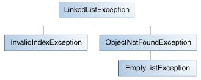

# 创建异常类

当面对选择抛出异常的类型时，您可以使用由别人编写的异常 - Java平台提供了许多可以使用的异常类 - 或者您可以编写自己的异常类。 如果您对任何以下问题回答“是”，您应该编写自己的异常类；否则，你可以使用别人的。

* 你需要一个Java平台中没有表示的异常类型吗？
* 如果用户能够区分你的异常与由其他供应商编写的类抛出的异常吗？
* 你的代码是否抛出不止一个相关的异常？
* 如果您使用他人的例外，用户是否可以访问这些异常？ 一个类似的问题是你的包是独立只提供自己使用吗？

## 一个例子

假设你正在写一个链表类。该类支持以下方法：

* objectAt(int n) - 返回列表中第n个位置的对象。如果参数小于0或大于当前列表中的对象数，则抛出异常。
* firstObject() - 返回列表中的第一个对象。如果列表不包含对象，则抛出异常。
* indexOf(Object o) - 搜索指定对象的列表，并返回其在列表中的位置。如果传入方法的对象不在列表中，则抛出异常。

链表类可以抛出多个异常，使用一个异常处理程序捕获链表所抛出的所有异常是很方便的。此外，如果您计划在包中分发链表，所有相关代码都应打包在一起。因此，链表应该提供自己的一组异常类。

下图说明了链表抛出的异常的一个可能的类层次结构。

## 选择超类

任何 Exception  子类都可以用作 LinkedListException 的父类。 然而，但这些子类有些专用的，有些又与 LinkedListException 完全无关。 因此，LinkedListException的父类应该是Exception。

你编写的大多数applet和应用程序都会抛出 Exception 对象。 Error 通常用于系统中严重的硬错误，例如阻止JVM运行的错误。

注意：对于可读代码，最好将字符串Exception附加到从异常类继承（直接或间接）的所有类的名称。

