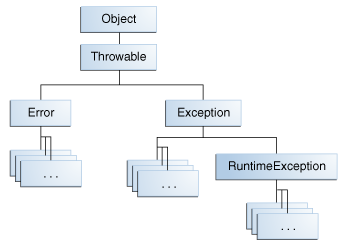

# 如何抛出异常

在你可以捕获异常之前，一些代码必须抛出一个异常。任何代码都可能会抛出异常：您的代码，来自其他人编写的包（例如Java平台附带的包）或Java运行时环境的代码。无论是什么引发的异常，它总是通过 throw 语句抛出。

您可能已经注意到，Java平台提供了许多异常类。所有类都是Throwable类的后代，并且都允许程序区分在程序执行期间可能发生的各种类型的异常。

您还可以创建自己的异常类来表示在您编写的类中可能发生的问题。事实上，如果您是包开发人员，您可能必须创建自己的一组异常类，以允许用户区分包中可能发生的错误与Java平台或其他包中发生的错误。

您还可以创建异常链。有关更多信息，请参阅“异常链”部分。

## throw语句

所有方法都使用throw语句抛出异常。 throw语句需要一个参数：throwable 对象。 Throwable 对象是Throwable类的任何子类的实例。 这里是一个throw 语句的例子。

```java
throw someThrowableObject;
```

让我们来看一下上下文中的throw语句。 以下pop方法取自实现公共堆栈对象的类。 该方法从堆栈中删除顶层元素并返回对象。

```java
public Object pop() {
    Object obj;

    if (size == 0) {
        throw new EmptyStackException();
    }

    obj = objectAt(size - 1);
    setObjectAt(size - 1, null);
    size--;
    return obj;
}
```

pop 方法将会检查栈中的元素。如果栈是空的（它的size等于0），则pop实例化一个 EmptyStackException对象（java.util的成员）并抛出它。 本章中的“创建异常类”部分介绍如何创建自己的异常类。 现在，所有你需要记住的是，你可以只抛出继承自java.lang.Throwable类的对象。

注意，pop方法的声明不包含throws子句。 EmptyStackException不是已检查异常，因此不需要pop来声明它可能发生。

### Throwable类及其子类

继承自Throwable类的对象包括直接后代（直接从Throwable类继承的对象）和间接后代（从Throwable类的子代或孙代继承的对象）。 下图说明了Throwable类及其最重要的子类的类层次结构。 正如你所看到的，Throwable有两个直接的后代：Error和Exception。





### Error 类

当Java虚拟机中发生动态链接故障或其他硬故障时，虚拟机会抛出 Error。简单的程序通常不捕获或抛出Error。

### Exception 类

大多数程序抛出和捕获从 Exception 类派生的对象。Exception 表示发生了问题，但它不是严重的系统问题。你编写的大多数程序将抛出并捕获Exception而不是 Error。

Java平台定义了 Exception  类的许多后代。这些后代表示可能发生的各种类型的异常。例如，IllegalAccessException表示找不到特定方法，NegativeArraySizeException表示程序尝试创建一个负大小的数组。

一个 Exception 子类RuntimeException保留用于指示不正确使用API​​的异常。运行时异常的一个示例是NullPointerException，当方法尝试通过空引用访问对象的成员时，会发生此异常。“未检查异常”章节讨论了为什么大多数应用程序不应该抛出运行时异常或RuntimeException的子类。