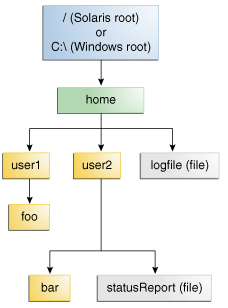
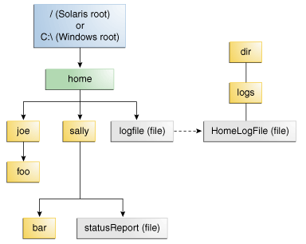

#  文件 I/O

本教程讲述的是 JDK 7 版本以来引入的新的 I/O 机制（也被称为 NIO.2）。

相关的包在 java.nio.file ，其中 java.nio.file.attribute 提供对文件 I/O 以及访问默认文件系统的全面支持。虽然 API 有很多类，但你只需要重点关注几个。你会看到，这个 API 是非常直观和易于使用。

## 什么是路径（Path）？在其他文件系统的实际是怎么样的？

文件系统是用某种媒体形式存储和组织文件，一般是一个或多个硬盘驱动器，以这样的方式，它们可以很容易地检索文件。目前使用的大多数文件系统存储文件是以树（或层次）结构。在树的顶部是一个（或多个）根节点。根节点下，有文件和目录（在Microsoft Windows 系统是指文件夹）。每个目录可以包含文件和子目录，而这又可以包含文件和子目录，以此类推，有可能是无限深度。

### 什么是路径（Path）？

下图显示了一个包含一个根节点的目录树。Microsoft Windows 支持多个根节点。每个根节点映射到一个卷，如 `C:\` 或 `D:\`。 Solaris OS 支持一个根节点，这由斜杠`/`表示。



文件系统通过路径来确定文件。例如，上图 statusReport 在 Solaris OS 描述为：

    /home/sally/statusReport

而在 Microsoft Windows 下，描述如下：

    C:\home\sally\statusReport
    
用来分隔目录名称的字符（也称为分隔符）是特定于文件系统的：Solaris OS 中使用正斜杠（/），而 Microsoft Windows 使用反斜杠（\）。

### 相对或绝对路径？

路径可以是相对或绝对的。绝对路径总是包含根元素以及找到该文件所需要的完整的目录列表。对于例如，` /home/sally/statusReport` 是一个绝对路径。所有找到的文件所需的信息都包含在路径字符串里。

相对路径需要与另一路径进行组合才能访问到文件。例如，`joe/foo` 是一个相对路径,没有更多的信息，程序不能可靠地定位 `joe/foo` 目录。

### 符号链接（Symbolic Links）

文件系统对象最典型的是目录或文件。每个人都熟悉这些对象。但是，某些文件系统还支持符号链接的概念。符号链接也被称为符号链接（symlink）或软链接（soft link）。

符号链接是，作为一个引用到另一个文件的特殊文件。在大多数情况下，符号链接对于应用程序来说透明的，符号链接上面的操作会被自动重定向到链接的目标（链接的目标是指该所指向的文件或目录）。当符号链接删除或重命名，在这种情况下，链接本身被删除或重命名，而不是链接的目标。

在下图中，logFile 对于用户来说看起来似乎是一个普通文件，但它实际上是 `dir/logs/HomeLogFile` 文件的符号链接。HomeLogFile 是链接的目标。




符号链接通常对用户来说是透明。读取或写入符号链接是和读取或写入到任何其他文件或目录是一样的。

解析链接（resolving a link）是指在文件系统中用实际位置取代符号链接。在这个例子中，logFile 解析为 `dir/logs/HomeLogFile`

在实际情况下，大多数文件系统自由使用的符号链接。有时，一不小心创建符号链接会导致循环引用。循环引用是指，当链接的目标点回到原来的链接。循环引用可能是间接的：目录 a 指向目录 b，b 指向目录 c，其中包含的子目录指回目录 a 。当一个程序被递归遍历目录结构时，循环引用可能会导致混乱。但是，这种情况已经做了限制，不会导致程序无限循环。

接下来章节将讨论 Java 文件 I/O 的核心 Path 类。

## Path 类

该 [Path](https://docs.oracle.com/javase/8/docs/api/java/nio/file/Path.html) 类是从 Java SE 7 开始引入的， 是 [java.nio.file](https://docs.oracle.com/javase/8/docs/api/java/nio/file/package-summary.html) 包的主要进入点之一。

*注：若果 Java SE 7 之前的版本，可以使用 [File.toPath](https://docs.oracle.com/javase/8/docs/api/java/io/File.html#toPath--) 实现 Path 类似的功能*

Path 类是在文件系统路径的编程表示。Path 对象包含了文件名和目录列表，用于构建路径，以及检查，定位和操作文件。

Path 实例反映了基础平台。在 Solaris OS,路径使用 Solaris 语法（`/home/joe/foo`）,而在 Microsoft Windows，路径使用 Windows 语法（`C:\home\joe\foo`）。路径是与系统相关，即 Solaris 文件系统中的路径不能与 Windows 文件系统的路径进行匹配。

对应于该路径的文件或目录可能不存在。您可以创建一个 Path 实例，并以各种方式操纵它：您可以附加到它，提取它的一部分，把它比作其他路径。在适当的时候，可以使用在 [Files](https://docs.oracle.com/javase/8/docs/api/java/nio/file/Files.html) 类的方法来检查对应路径的文件是否存在，创建文件，打开它，删除它，改变它的权限，等等。

### Path 操作

Path 类包括各种方法，可用于获得关于路径信息，路径的接入元件，路径转换为其它形式，或提取路径的部分。也有用于匹配的路径字符串的方法，也有用于在一个路径去除冗余的方法。这些路径方法，有时也被称为语义操作（syntactic operations），因为是在它们的路径本身进行操作，而不是访问文件系统。

#### 创建路径

Path 实例包含用于指定文件或目录的位置的信息。在它被定义的时候，一个 Path 上设置了一系列的一个或多个名称。根元素或文件名可能被包括在内，但也不是必需的。Path 可能包含只是一个单一的目录或文件名。

您可以通过 [Paths](https://docs.oracle.com/javase/8/docs/api/java/nio/file/Paths.html)（注意是复数）助手类的 get 方法很容易地创建一个 Path 对象：

    Path p1 = Paths.get("/tmp/foo");
    Path p2 = Paths.get(args[0]);
    Path p3 = Paths.get(URI.create("file:///Users/joe/FileTest.java"));

Paths.get 是下面方式的简写：

    Path p4 = FileSystems.getDefault().getPath("/users/sally");
    
下面的例子假设你的 home 目录是 `/u/joe`,则将创建`/u/joe/logs/foo.log`, 或若果是 Windows 环境，则为`C:\joe\logs\foo.log`

#### 检索有关一个路径

你可以把路径作为储存这些名称元素的序列。在目录结构中的最高元素将设在索引为0的目录结构中，而最低元件将设在索引 [n-1]，其中 n 是 Path 的元素个数。方法可用于检索各个元素或使用这些索引 Path 的子序列。

本示例使用下面的目录结构：


下面的代码片段定义了一个 Path 实例，然后调用一些方法来获取有关的路径信息：

    // None of these methods requires that the file corresponding
    // to the Path exists.
    // Microsoft Windows syntax
    Path path = Paths.get("C:\\home\\joe\\foo");
    
    // Solaris syntax
    Path path = Paths.get("/home/joe/foo");
    
    System.out.format("toString: %s%n", path.toString());
    System.out.format("getFileName: %s%n", path.getFileName());
    System.out.format("getName(0): %s%n", path.getName(0));
    System.out.format("getNameCount: %d%n", path.getNameCount());
    System.out.format("subpath(0,2): %s%n", path.subpath(0,2));
    System.out.format("getParent: %s%n", path.getParent());
    System.out.format("getRoot: %s%n", path.getRoot());

下面是 Windows 和 Solaris OS 不同的输出:

方法 |  Solaris OS	 返回 | Microsoft Windows	返回
---- | ---- | ----
toString |	/home/joe/foo	| C:\home\joe\foo	
getFileName	 |	foo	 |	foo	 
getName(0)	 |	home |	home
getNameCount	 |	3	 |	3	
subpath(0,2)	 |	home/joe	 |	home\joe
getParent	 |	/home/joe  |	\home\joe	
getRoot	 |	/  |	C:\	

下面是一个相对路径的例子：

    // Solaris syntax
    Path path = Paths.get("sally/bar");
    or
    // Microsoft Windows syntax
    Path path = Paths.get("sally\\bar");
    
下面是 Windows 和 Solaris OS 不同的输出:

方法 |  Solaris OS	 返回 | Microsoft Windows	返回
---- | ---- | ----
toString |  	sally/bar	 |  sally\bar
getFileName |  	bar |  	bar
getName(0)	 |  sally |  	sally
getNameCount |  	2 |  2
subpath(0,1) |  	sally	 |  sally
getParent	 |  sally	 |  sally
getRoot	 |  null |  	null

#### 从 Path 中移除冗余

许多文件系统使用“.”符号表示当前目录，“..”来表示父目录。您可能有一个 Path 包含冗余目录信息的情况。也许一个服务器配置为保存日志文件在“/dir/logs/.”目录，你想删除后面的“/.”

下面的例子都包含冗余：

    /home/./joe/foo
    /home/sally/../joe/foo

normalize 方法是删除任何多余的元素，其中包括任何 出现的“.”或“directory/...”。前面的例子规范化为 `/home/joe/foo`

要注意，当它清理一个路径时，normalize 不检查文件系统。这是一个纯粹的句法操作。在第二个例子中，如果 sally 是一个符号链接，删除`sally/..` 可能会导致不能定位的预期文件。

清理路径的同时，你可以使用 toRealPath 方法来确保结果定位正确的文件。此方法在下一节中描述

#### 转换一个路径

可以使用3个方法来转换路径。[toUri](https://docs.oracle.com/javase/8/docs/api/java/nio/file/Path.html#toUri--) 将路径转换为可以在浏览器中打开一个字符串，例如：

    Path p1 = Paths.get("/home/logfile");
    // Result is file:///home/logfile
    System.out.format("%s%n", p1.toUri());
   
[toAbsolutePath](https://docs.oracle.com/javase/8/docs/api/java/nio/file/Path.html#toAbsolutePath--) 方法将路径转为绝对路径。如果传递的路径已是绝对的，则返回同一Path 对象。toAbsolutePath 方法可以非常有助于处理用户输入的文件名。例如

```java
public class FileTest {
	/**
	 * @param args
	 */
	public static void main(String[] args) {

        if (args.length < 1) {
            System.out.println("usage: FileTest file");
            System.exit(-1);
        }

        // Converts the input string to a Path object.
        Path inputPath = Paths.get(args[0]);

        // Converts the input Path
        // to an absolute path.
        // Generally, this means prepending
        // the current working
        // directory.  If this example
        // were called like this:
        //     java FileTest foo
        // the getRoot and getParent methods
        // would return null
        // on the original "inputPath"
        // instance.  Invoking getRoot and
        // getParent on the "fullPath"
        // instance returns expected values.
        Path fullPath = inputPath.toAbsolutePath();
	}
}
```

该 toAbsolutePath 方法转换用户输入并返回一个 Path 对于查询时返回是有用的值。此方法不需要文件存在才能正常工作。

[toRealPath](https://docs.oracle.com/javase/8/docs/api/java/nio/file/Path.html#toRealPath-java.nio.file.LinkOption...-) 方法返回一个已经存在文件的真实的路径，此方法执行以下其中一个：

* 如果 true 被传递到该方法，同时文件系统支持符号链接，那么该方法可以解析路径中的任何符号链接。
* 如果 Path 是相对的，它返回一个绝对路径。
* 如果 Path 中包含任何冗余元素，则返回一个删除冗余元素的路径。

若文件不存在或者无法访问,则方法抛出异常。可以捕捉处理异常：

    try {
        Path fp = path.toRealPath();
    } catch (NoSuchFileException x) {
        System.err.format("%s: no such" + " file or directory%n", path);
        // Logic for case when file doesn't exist.
    } catch (IOException x) {
        System.err.format("%s%n", x);
        // Logic for other sort of file error.
    }
    
    
#### 连接两个路径

可以使用 resolve 连接两个路径。你传递一个局部路径（partial path, 不包括一个根元素的路径），可以将局部路径追加到原始的路径。

例如，请考虑下面的代码片段：

    // Solaris
    Path p1 = Paths.get("/home/joe/foo");
    // Result is /home/joe/foo/bar
    System.out.format("%s%n", p1.resolve("bar"));
    
    or
    
    // Microsoft Windows
    Path p1 = Paths.get("C:\\home\\joe\\foo");
    // Result is C:\home\joe\foo\bar
    System.out.format("%s%n", p1.resolve("bar"));

传递相对路径到 resolve 方法返回路径中的传递路径：

    // Result is /home/joe
    Paths.get("foo").resolve("/home/joe");


#### 在两个路径间创建路径

文件 I/O 代码中的常见的需求是从路径能在不同的文件系统中兼容。可以使用relativize 方法满足这一点。新的路径是相对于原来的路径。

例如，定义为 joe 和 sally 相对路径：

    Path p1 = Paths.get("joe");
    Path p2 = Paths.get("sally");
    
在没有任何其他信息的，假定  joe 和 sally 是同一级别的节点。从 joe 导航到 sally，你会希望首先导航上一级父节点，然后向下找到 sally：

    // Result is ../sally
    Path p1_to_p2 = p1.relativize(p2);
    // Result is ../joe
    Path p2_to_p1 = p2.relativize(p1);
    
下面是复杂点的例子:

    Path p1 = Paths.get("home");
    Path p3 = Paths.get("home/sally/bar");
    // Result is sally/bar
    Path p1_to_p3 = p1.relativize(p3);
    // Result is ../..
    Path p3_to_p1 = p3.relativize(p1);
    
Copy 是个完整的使用 relativize 和 resolve  的例子：

```java
public class Copy {

    /**
     * Returns {@code true} if okay to overwrite a  file ("cp -i")
     */
    static boolean okayToOverwrite(Path file) {
        String answer = System.console().readLine("overwrite %s (yes/no)? ", file);
        return (answer.equalsIgnoreCase("y") || answer.equalsIgnoreCase("yes"));
    }

    /**
     * Copy source file to target location. If {@code prompt} is true then
     * prompt user to overwrite target if it exists. The {@code preserve}
     * parameter determines if file attributes should be copied/preserved.
     */
    static void copyFile(Path source, Path target, boolean prompt, boolean preserve) {
        CopyOption[] options = (preserve) ?
            new CopyOption[] { COPY_ATTRIBUTES, REPLACE_EXISTING } :
            new CopyOption[] { REPLACE_EXISTING };
        if (!prompt || Files.notExists(target) || okayToOverwrite(target)) {
            try {
                Files.copy(source, target, options);
            } catch (IOException x) {
                System.err.format("Unable to copy: %s: %s%n", source, x);
            }
        }
    }

    /**
     * A {@code FileVisitor} that copies a file-tree ("cp -r")
     */
    static class TreeCopier implements FileVisitor<Path> {
        private final Path source;
        private final Path target;
        private final boolean prompt;
        private final boolean preserve;

        TreeCopier(Path source, Path target, boolean prompt, boolean preserve) {
            this.source = source;
            this.target = target;
            this.prompt = prompt;
            this.preserve = preserve;
        }

        @Override
        public FileVisitResult preVisitDirectory(Path dir, BasicFileAttributes attrs) {
            // before visiting entries in a directory we copy the directory
            // (okay if directory already exists).
            CopyOption[] options = (preserve) ?
                new CopyOption[] { COPY_ATTRIBUTES } : new CopyOption[0];

            Path newdir = target.resolve(source.relativize(dir));
            try {
                Files.copy(dir, newdir, options);
            } catch (FileAlreadyExistsException x) {
                // ignore
            } catch (IOException x) {
                System.err.format("Unable to create: %s: %s%n", newdir, x);
                return SKIP_SUBTREE;
            }
            return CONTINUE;
        }

        @Override
        public FileVisitResult visitFile(Path file, BasicFileAttributes attrs) {
            copyFile(file, target.resolve(source.relativize(file)),
                     prompt, preserve);
            return CONTINUE;
        }

        @Override
        public FileVisitResult postVisitDirectory(Path dir, IOException exc) {
            // fix up modification time of directory when done
            if (exc == null && preserve) {
                Path newdir = target.resolve(source.relativize(dir));
                try {
                    FileTime time = Files.getLastModifiedTime(dir);
                    Files.setLastModifiedTime(newdir, time);
                } catch (IOException x) {
                    System.err.format("Unable to copy all attributes to: %s: %s%n", newdir, x);
                }
            }
            return CONTINUE;
        }

        @Override
        public FileVisitResult visitFileFailed(Path file, IOException exc) {
            if (exc instanceof FileSystemLoopException) {
                System.err.println("cycle detected: " + file);
            } else {
                System.err.format("Unable to copy: %s: %s%n", file, exc);
            }
            return CONTINUE;
        }
    }

    static void usage() {
        System.err.println("java Copy [-ip] source... target");
        System.err.println("java Copy -r [-ip] source-dir... target");
        System.exit(-1);
    }

    public static void main(String[] args) throws IOException {
        boolean recursive = false;
        boolean prompt = false;
        boolean preserve = false;

        // process options
        int argi = 0;
        while (argi < args.length) {
            String arg = args[argi];
            if (!arg.startsWith("-"))
                break;
            if (arg.length() < 2)
                usage();
            for (int i=1; i<arg.length(); i++) {
                char c = arg.charAt(i);
                switch (c) {
                    case 'r' : recursive = true; break;
                    case 'i' : prompt = true; break;
                    case 'p' : preserve = true; break;
                    default : usage();
                }
            }
            argi++;
        }

        // remaining arguments are the source files(s) and the target location
        int remaining = args.length - argi;
        if (remaining < 2)
            usage();
        Path[] source = new Path[remaining-1];
        int i=0;
        while (remaining > 1) {
            source[i++] = Paths.get(args[argi++]);
            remaining--;
        }
        Path target = Paths.get(args[argi]);

        // check if target is a directory
        boolean isDir = Files.isDirectory(target);

        // copy each source file/directory to target
        for (i=0; i<source.length; i++) {
            Path dest = (isDir) ? target.resolve(source[i].getFileName()) : target;

            if (recursive) {
                // follow links when copying files
                EnumSet<FileVisitOption> opts = EnumSet.of(FileVisitOption.FOLLOW_LINKS);
                TreeCopier tc = new TreeCopier(source[i], dest, prompt, preserve);
                Files.walkFileTree(source[i], opts, Integer.MAX_VALUE, tc);
            } else {
                // not recursive so source must not be a directory
                if (Files.isDirectory(source[i])) {
                    System.err.format("%s: is a directory%n", source[i]);
                    continue;
                }
                copyFile(source[i], dest, prompt, preserve);
            }
        }
    }
}
```

#### 比较两个路径

Path 类支持 [equals](https://docs.oracle.com/javase/8/docs/api/java/nio/file/Path.html#equals-java.lang.Object-)，从而使您能够测试两个路径是否相等。[startsWith](https://docs.oracle.com/javase/8/docs/api/java/nio/file/Path.html#startsWith-java.nio.file.Path-) 和 [endsWith](https://docs.oracle.com/javase/8/docs/api/java/nio/file/Path.html#endsWith-java.nio.file.Path-) 方法，可以测试路径中是否有特定的字符串开头或者结尾。这些方法很容易使用。 例如：

    Path path = ...;
    Path otherPath = ...;
    Path beginning = Paths.get("/home");
    Path ending = Paths.get("foo");
    
    if (path.equals(otherPath)) {
        // equality logic here
    } else if (path.startsWith(beginning)) {
        // path begins with "/home"
    } else if (path.endsWith(ending)) {
        // path ends with "foo"
    }
    
Path 类实现了 [Iterable](https://docs.oracle.com/javase/8/docs/api/java/lang/Iterable.html) 接口。 iterator 方法返回一个对象，使您可以遍历路径中的元素名。返回的第一个元素是最接近目录树的根。下面的代码片段遍历路径，打印每个name 元素：

    Path path = ...;
    for (Path name: path) {
        System.out.println(name);
    }

该类同时还是实现了  [Comparable](https://docs.oracle.com/javase/8/docs/api/java/lang/Comparable.html) 接口，可以 compareTo 方法对于排序过的 Path 对象进行比较 。

你也可以把 Path 对象到放到 Collection。见集合线索有关此强大功能的更多信息。

如果您想验证两个 Path 对象是否定位同一个文件，可以使用 isSameFile 方法。

## File(文件)操作

[Files](https://docs.oracle.com/javase/8/docs/api/java/nio/file/Files.html) 类是 java.nio.file 包的其他主要入口。这个类提供了一组丰富的静态方法，用于读取、写入和操作文件和目录。Files 方法可以作用于 Path 对象实例。要进入下章节的学习，首先要建立如下概念：

### 释放系统资源

有许多使用此 API 的资源，如流或信道的，都实现或者继承了 [java.io.Closeable](https://docs.oracle.com/javase/8/docs/api/java/io/Closeable.html) 接口。一个 Closeable 的资源需在不用时调用 close 方法以释放资源。忘记关闭资源对应用程序的性能可能产生负面影响。

### 捕获异常

所有方法访问文件系统都可以抛出 IOException。最佳实践是通过 `try-with-resources` 语句（Java SE 7 引入该语句）来捕获异常。

使用 `try-with-resources` 语句的好处是，在资源不需要时，编译器会自动生成的代码以关闭资源。下面的代码显示了如何用：

    Charset charset = Charset.forName("US-ASCII");
    String s = ...;
    try (BufferedWriter writer = Files.newBufferedWriter(file, charset)) {
        writer.write(s, 0, s.length());
    } catch (IOException x) {
        System.err.format("IOException: %s%n", x);
    }

或者，你可以使用  try-catch-finally 语句，在 finally 块记得关闭它们。例子如下：

    Charset charset = Charset.forName("US-ASCII");
    String s = ...;
    BufferedWriter writer = null;
    try {
        writer = Files.newBufferedWriter(file, charset);
        writer.write(s, 0, s.length());
    } catch (IOException x) {
        System.err.format("IOException: %s%n", x);
    } finally {
        if (writer != null) writer.close();
    }
    
除了 IOException 异常，许多异常都继承了 [FileSystemException](https://docs.oracle.com/javase/8/docs/api/java/nio/file/FileSystemException.html)。这个类有一些有用的方法，如返回所涉及的文件 ([getFile](https://docs.oracle.com/javase/8/docs/api/java/nio/file/FileSystemException.html#getFile--)) ，详细信息字符串（[getMessage](https://docs.oracle.com/javase/8/docs/api/java/nio/file/FileSystemException.html#getMessage--)），文件系统操作失败的原因（[getReason](https://docs.oracle.com/javase/8/docs/api/java/nio/file/FileSystemException.html#getReason--)），以及所涉及的“其他”的文件，如果有的话（[getOtherFile](https://docs.oracle.com/javase/8/docs/api/java/nio/file/FileSystemException.html#getOtherFile--)）。

下面的代码片段显示了 getFile 方法的使用：

    try (...) {
        ...    
    } catch (NoSuchFileException x) {
        System.err.format("%s does not exist\n", x.getFile());
    }
    

### 可变参数

Files 方法可以接受 可变参数，用法如

    Path Files.move(Path, Path, CopyOption...)
    
可变参数可以用逗号隔开的数组 (CopyOption[]) ，用法：

    import static java.nio.file.StandardCopyOption.*;
    
    Path source = ...;
    Path target = ...;
    Files.move(source,
               target,
               REPLACE_EXISTING,
               ATOMIC_MOVE);


### 原子操作

几个 Files 的方法，如 move，是可以在某些文件系统上执行某些原子操作的。


原子文件操作是不能被中断或不能进行“部分”的操作。整个操作要不就执行不要就操作失败。在多个进程中操作相同的文件系统，需要保证每个进程访问一个完整的文件，这是非常重要的。

### 方法链

许多文件 I/O 支持方法链。例如：

    String value = Charset.defaultCharset().decode(buf).toString();
    UserPrincipal group =
        file.getFileSystem().getUserPrincipalLookupService().
             lookupPrincipalByName("me");
             
该技术可以生成紧凑的代码，使您避免声明不需要临时变量。           
         
### 什么是 Glob？

Glob 是一种模式，它使用通配符来指定文件或者目录名名称。例如：`*.java`就是一个简单的 Glob，它指定了所有扩展名为“java”的文件。其中

* `*`表示“任意的字符或字符组成字符串”
* `**`原理类似于`*`，但可以越过目录。此语法通常用于匹配的完整路径。
* `?`表示“任意单个字符”
* 大括号指定子模式的集合。 例如：
    * {sun,moon,stars} 匹配 "sun", "moon", 或 "stars"
    * {temp*,tmp*} 匹配所有 "temp" 或 "tmp" 开头的字符串
* 方括号传达了单个字符集合，或者使用连字符（-）时的字符的范围。 例如：
    * [aeiou]匹配任意小写元音。
    * [0-9]匹配任意数字。
    * [A-Z]匹配任意大写字母。
    * [a-z,A-Z]匹配任何大写或小写字母。
    
在方括号中，`*`，`？`，和`\`与自身匹配。
* 所有其他字符与自身匹配。
* 要匹配`*` ,`?`或其他特殊字符，您可以用反斜杠字符转义`\`。例如：`\\`匹配一个反斜杠，`\？`匹配问号。
 
下面是一些 Glob 的一些例子：

* `*.html` - 匹配结尾以 .html 的所有字符串
* `???` - 匹配所有的字符串恰好有三个字母或数字
* `*[0-9]*` - 匹配含有数字值的所有字符串
* `*.{htm,html,pdf}` - 匹配具有的 .htm 或 .html 或 .pdf 结尾的字符串
* `a?*.java？` - 匹配 a 开头随后跟至少一个字母或数字，并以 .java 结尾的字符串
* `{foo*,*[0-9]*}` - 匹配任何以 foo 开头的或包含数值的字符串

Glob 模式源于Unix操作系统，Unix 提供了一个“global命令”,它可以缩写为glob。Glob 模式与正则表达式类似，但它的功能有限。 详见 FileSystem 类的 [getPathMatcher](https://docs.oracle.com/javase/8/docs/api/java/nio/file/FileSystem.html#getPathMatcher-java.lang.String-) 。


### 链接意识

Files 方法在遇到符号链接时，要检测做什么，或者提供启用怎样的配置选项。


## 检查文件或目录

### 验证文件或者目录是否存在

使用 exists(Path, LinkOption...) 和 the notExists(Path, LinkOption...) 方法。注意 !Files.exists(path) 不同等于 Files.notExists(path)。当您在验证文件是否存在，三种可能的结果：

* 该文件被确认存在
* 该文件被证实不存在的
* 该文件的状态未知。当程序没有访问该文件时，可能会发生此结果。

若 exists 和 notExists 同时返回 false，则该文件的是否存在不能被验证。

### 检查是否可访问

使用 isReadable(Path), isWritable(Path), 和 isExecutable(Path) 来验证程序是否可以访问文件。

下面的代码片段验证一个特定的文件是否存在，以及该程序能够执行该文件：

    Path file = ...;
    boolean isRegularExecutableFile = Files.isRegularFile(file) &
             Files.isReadable(file) & Files.isExecutable(file);
         
*注：一旦这些方法中的任何一个完成，就无法再保证文件是可以访问的了。所以，在许多应用程序中的一个共同安全缺陷是先执行一个检查，然后访问该文件。有关更多信息，使用搜索引擎查找 TOCTTOU* 

### 检查是否有两个路径定位了相同的文件

在使用符号链接的文件系统中，就可能有两个定位到相同文件的不同的路径。使用 [isSameFile(Path, Path)](https://docs.oracle.com/javase/8/docs/api/java/nio/file/Files.html#isSameFile-java.nio.file.Path-java.nio.file.Path-) 方法比较两个路径，以确定它们在该文件系统上是否定位为同一个文件。 例如：

    Path p1 = ...;
    Path p2 = ...;
    
    if (Files.isSameFile(p1, p2)) {
        // Logic when the paths locate the same file
    }

## 删除文件或目录

您可以删除文件，目录或链接。如果是符号链接，则该链接被删除后，不会删除所链接的目标。对于目录来说，该目录必须是空的，否则删除失败。

Files 类提供了两个删除方法。

[delete(Path)](https://docs.oracle.com/javase/8/docs/api/java/nio/file/Files.html#delete-java.nio.file.Path-) 方法删除文件或者删除失败将引发异常。例如，如果文件不存在就抛出 NoSuchFileException。您可以捕获该异常，以确定为什么删除失败，如下所示：

    try {
        Files.delete(path);
    } catch (NoSuchFileException x) {
        System.err.format("%s: no such" + " file or directory%n", path);
    } catch (DirectoryNotEmptyException x) {
        System.err.format("%s not empty%n", path);
    } catch (IOException x) {
        // File permission problems are caught here.
        System.err.println(x);
    }

[deleteIfExists(Path)](https://docs.oracle.com/javase/8/docs/api/java/nio/file/Files.html#deleteIfExists-java.nio.file.Path-) 同样是删除文件，但在文件不存在时不会抛出异常。这在多个线程处理删除文件又不想抛出异常是很有用的。


## 复制文件或目录

使用 [copy(Path, Path, CopyOption...)](https://docs.oracle.com/javase/8/docs/api/java/nio/file/Files.html#copy-java.nio.file.Path-java.nio.file.Path-java.nio.file.CopyOption...-) 方法。如果目标文件已经存在了，则复制就会失败，除非指定  REPLACE_EXISTING 选项来替换已经存在的文件。

目录可以被复制。但是，目录内的文件不会被复制，因此新目录是空的，即使原来的目录中包含的文件。

当复制一个符号链接，链接的目标被复制。如果你想复制链接本身而不是链接的内容，请指定的 NOFOLLOW_LINKS 或 REPLACE_EXISTING 选项。

这种方法需要一个可变参数的参数。下面 StandardCopyOption 和 LinkOption 枚举是支持的：

* REPLACE_EXISTING - 执行复制，即使目标文件已经存在。如果目标是一个符号链接，则链接本身被复制（而不是链接所指向的目标）。如果目标是一个非空目录，复制失败抛出 FileAlreadyExistsException。
* COPY_ATTRIBUTES - 复制文件属性复制到目标文件。所支持的准确的文件属性是和文件系统和平台相关的，但是 last-modified-time  是支持跨平台的，将被复制到目标文件。
* NOFOLLOW_LINKS - 指示符号链接不应该被跟随。如果要复制的文件是一个符号链接，该链接被复制（而不是链接的目标）

下面演示了 copy  的用法：

    import static java.nio.file.StandardCopyOption.*;
    ...
    Files.copy(source, target, REPLACE_EXISTING);

其他方法还包括，[copy(InputStream, Path, CopyOptions...) ](https://docs.oracle.com/javase/8/docs/api/java/nio/file/Files.html#copy-java.io.InputStream-java.nio.file.Path-java.nio.file.CopyOption...-) 方法可用于所有字节从输入流复制到文件中。 [copy(Path, OutputStream)](https://docs.oracle.com/javase/8/docs/api/java/nio/file/Files.html#copy-java.nio.file.Path-java.io.OutputStream-) 方法可用于所有字节从一个文件复制到输出流中。


## 移动一个文件或目录

使用 [move(Path, Path, CopyOption...)](https://docs.oracle.com/javase/8/docs/api/java/nio/file/Files.html#move-java.nio.file.Path-java.nio.file.Path-java.nio.file.CopyOption...-)  方法。如果目标文件已经存在，则移动失败，除非指定了 REPLACE_EXISTING  选项

空目录可以移动。如果该目录不为空，那么在移动时可以选择只移动该目录而不移动该目录中的内容。在 UNIX 系统中，移动在同一分区内的目录一般包括重命名的目录。在这种情况下，即使该目录包含文件，这方法仍然可行。

该方法采用可变参数的参数 - 以下 StandardCopyOption 枚举的支持：

* REPLACE_EXISTING - 执行移动，即使目标文件已经存在。如果目标是一个符号链接，符号链接被替换，但它指向的目标是不会受到影响。
* ATOMIC_MOVE - 此举为一个原子文件操作。如果文件系统不支持原子移动，将引发异常。在 ATOMIC_MOVE 选项下，将文件移动到一个目录时，可以保证任何进程访问目录时都看到的是一个完整的文件。


下面介绍如何使用 move 方法：

    import static java.nio.file.StandardCopyOption.*;
    ...
    Files.move(source, target, REPLACE_EXISTING);


## 管理元数据（文件和文件存储的属性）
## 阅读，写作，和创建文件
## 随机访问文件
## 创建和读取目录
## 链接，符号或否则
## 走在文件树
## 查找文件
## 看目录的更改
## 其他有用的方法
## 传统的文件I/ O代码
