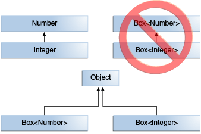
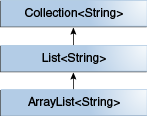
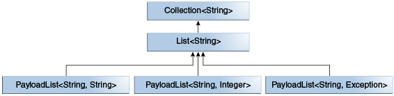

# 泛型（Generics）

泛型通过在编译时检测到更多的代码 bug 从而使你的代码更加稳定。

## 泛型的作用

概括地说，泛型支持类型（类和接口）在定义类，接口和方法时作为参数。就像在方法声明中使用的形式参数（formal parameters），类型参数提供了一种输入可以不同但代码可以重用的方式。所不同的是，形式参数的输入是值，类型参数输入的是类型参数。

使用泛型对比非泛型代码有很多好处：

* 在编译时更强的类型检查。

如果代码违反了类型安全，Java 编译器将针对泛型和问题错误采用强大的类型检查。修正编译时的错误比修正运行时的错误更加容易。

* 消除了强制类型转换。

没有泛型的代码片需要强制转化：

```
List list = new ArrayList();
list.add("hello");
String s = (String) list.get(0);
```

当重新编写使用泛型，代码不需要强转：

```
List<String> list = new ArrayList<String>();
list.add("hello");
String s = list.get(0);   // no cast
```

* 使编程人员能够实现通用算法。

通过使用泛型，程序员可以实现工作在不同类型集合的通用算法，并且是可定制，类型安全，易于阅读。

## 泛型类型（Generic Type）

泛型类型是参数化类型的泛型类或接口。下面是一个 Box 类例子来说明这个概念。

### 一个简单的 Box 类

```java
public class Box {
	private Object object;

	public void set(Object object) {
		this.object = object;
	}

	public Object get() {
		return object;
	}
}
```

由于它的方法接受或返回一个 Object，你可以自由地传入任何你想要的类型，只要它不是原始的类型之一。在编译时，没有办法验证如何使用这个类。代码的一部分可以设置 Integer 并期望得到 Integer ，而代码的另一部分可能会由于错误地传递一个String ，而导致运行错误。

### 一个泛型版本的 Box 类

泛型类定义语法如下：

```
class name<T1, T2, ..., Tn> { /* ... */ }
```

类型参数部分用 `<>` 包裹，制定了类型参数或称为类型变量（type parameters or  type variables) T1, T2, ..., 直到 Tn.

下面是代码：

```java
public class Box<T> {
	// T stands for "Type"
	private T t;

	public void set(T t) {
		this.t = t;
	}

	public T get() {
		return t;
	}

}
```

主要，所有的 Object 被 T 代替了。类型变量可以是非基本类型的的任意类型，任意的类、接口、数组或其他类型变量。

这个技术同样适用于泛型接口的创建。

### 类型参数命名规范

按照惯例，类型参数名称是单个大写字母，用来区别普通的类或接口名称。

常用的类型参数名称如下：

```
E - Element (由 Java 集合框架广泛使用)
K - Key
N - Number
T - Type
V - Value
S,U,V 等. - 第二种、第三种、第四种类型
```

### 调用和实例化一个泛型

从代码中引用泛型 Box 类，则必须执行一个泛型调用(generic type invocation)，用具体的值，比如 Integer 取代 T ：

```
Box<Integer> integerBox;
```

泛型调用与普通的方法调用类似，所不同的是传递参数是类型参数（type argument ），本例就是传递 Integer 到 Box 类：

*Type Parameter 和 Type Argument 区别*

*编码时，提供  type argument 的一个原因是为了创建 参数化类型。因此，`Foo<T>` 中的 T 是一个 type parameter， 而 `Foo<String>` 中的 String 是一个 type argument*

与其他变量声明类似，代码实际上没有创建一个新的 Box 对象。它只是声明integerBox 在读到 `Box<Integer>` 时，保存一个“Integer 的 Box”的引用。

泛型的调用通常被称为一个参数化类型（parameterized type）。

实例化类，使用 new 关键字：

```
Box<Integer> integerBox = new Box<Integer>();
```

### 菱形（Diamond）

Java SE 7 开始泛型可以使用空的类型参数集`<>`，只要编译器能够确定，或推断，该类型参数所需的类型参数。这对尖括号`<>`，被非正式地称为“菱形（diamond）”。例如：

```
Box<Integer> integerBox = new Box<>();
```

### 多类型参数

下面是一个泛型 Pair 接口和一个泛型 OrderedPair ：

```
public interface Pair<K, V> {
    public K getKey();
    public V getValue();
}

public class OrderedPair<K, V> implements Pair<K, V> {

    private K key;
    private V value;

    public OrderedPair(K key, V value) {
	this.key = key;
	this.value = value;
    }

    public K getKey()	{ return key; }
    public V getValue() { return value; }
}
```

创建两个 OrderedPair 实例：

```
Pair<String, Integer> p1 = new OrderedPair<String, Integer>("Even", 8);
Pair<String, String>  p2 = new OrderedPair<String, String>("hello", "world");
```

代码 `new OrderedPair<String, Integer>`，实例 K 作为一个 String 和 V 为 Integer。因此，OrderedPair 的构造函数的参数类型是 String 和 Integer。由于自动装箱（autoboxing），可以有效的传递一个 String 和 int 到这个类。

可以使用菱形（diamond）来简化代码：

```
OrderedPair<String, Integer> p1 = new OrderedPair<>("Even", 8);
OrderedPair<String, String>  p2 = new OrderedPair<>("hello", "world");
```

### 参数化类型

您也可以用 参数化类型（例如，`List<String>`的）来替换类型参数（即 K 或 V ）。例如，使用`OrderedPair<K，V>`例如：

```
OrderedPair<String, Box<Integer>> p = new OrderedPair<>("primes", new Box<Integer>(...));
```

### 原生类型（Raw Types）

原生类型是没有类型参数(type arguments)的泛型类和泛型接口，如泛型 Box 类;

```java
public class Box<T> {
    public void set(T t) { /* ... */ }
    // ...
}
```

要创建参数化类型的`Box<T>`，需要为形式类型参数T提供实际的类型参数：

```java
Box<Integer> intBox = new Box<>();
```

如果想省略实际的类型参数，则需要创建一个`Box<T>`的原生类型：

```java
Box rawBox = new Box();
```

因此，Box是泛型`Box<T>`的原生类型。但是，非泛型的类或接口类型不是原始类型。


JDK为了保证向后兼容，允许将参数化类型分配给其原始类型：

```java
Box<String> stringBox = new Box<>();
Box rawBox = stringBox;               // OK
```

但如果将原始类型与参数化类型进行管理，则会得到告警：

```java
Box rawBox = new Box();           // rawBox is a raw type of Box<T>
Box<Integer> intBox = rawBox;     // warning: unchecked conversion
```

如果使用原始类型调用相应泛型类型中定义的泛型方法，也会收到警告：

```java
Box<String> stringBox = new Box<>();
Box rawBox = stringBox;
rawBox.set(8);  // warning: unchecked invocation to set(T)
```


警告显示原始类型绕过泛型类型检查，将不安全代码的捕获推迟到运行时。因此，开发人员应该避免使用原始类型。


## 泛型方法（Generic Method）

泛型方法是引入其自己的类型参数的方法。这类似于声明泛型类型，但类型参数的范围仅限于声明它的方法。允许使用静态和非静态泛型方法，以及泛型类构造函数。

泛型方法的语法包括一个类型参数列表，在尖括号内，它出现在方法的返回类型之前。对于静态泛型方法，类型参数部分必须出现在方法的返回类型之前。

下面例子中，Util类包含一个泛型方法compare，用于比较两个Pair对象：

```java
public class Util {
    public static <K, V> boolean compare(Pair<K, V> p1, Pair<K, V> p2) {
        return p1.getKey().equals(p2.getKey()) &&
               p1.getValue().equals(p2.getValue());
    }
}

public class Pair<K, V> {

    private K key;
    private V value;

    public Pair(K key, V value) {
        this.key = key;
        this.value = value;
    }

    public void setKey(K key) { this.key = key; }
    public void setValue(V value) { this.value = value; }
    public K getKey()   { return key; }
    public V getValue() { return value; }
}
```

以下是方法的调用：

```java
Pair<Integer, String> p1 = new Pair<>(1, "apple");
Pair<Integer, String> p2 = new Pair<>(2, "pear");
boolean same = Util.<Integer, String>compare(p1, p2);
```

其中，compare方法的类型通常可以省略，因为编译器将推断所需的类型：

```java
Pair<Integer, String> p1 = new Pair<>(1, "apple");
Pair<Integer, String> p2 = new Pair<>(2, "pear");
boolean same = Util.compare(p1, p2);
```


## 有界类型参数（Bounded Type Parameter）


有时可能希望限制可在参数化类型中用作类型参数的类型。例如，对数字进行操作的方法可能只想接受Number或其子类的实例。这时，就需要用到有界类型参数。

要声明有界类型参数，先要列出类型参数的名称，然后是extends关键字，后面跟着它的上限，比如下面例子中的Number：


```java
public class Box<T> {

    private T t;          

    public void set(T t) {
        this.t = t;
    }

    public T get() {
        return t;
    }

    public <U extends Number> void inspect(U u){
        System.out.println("T: " + t.getClass().getName());
        System.out.println("U: " + u.getClass().getName());
    }

    public static void main(String[] args) {
        Box<Integer> integerBox = new Box<Integer>();
        integerBox.set(new Integer(10));
        integerBox.inspect("some text"); // error: this is still String!
    }
}
```

上面代码将会编译失败，报错如下：

```
Box.java:21: <U>inspect(U) in Box<java.lang.Integer> cannot
  be applied to (java.lang.String)
                        integerBox.inspect("10");
                                  ^
1 error
```


除了限制可用于实例化泛型类型的类型之外，有界类型参数还允许调用边界中定义的方法：

```java
public class NaturalNumber<T extends Integer> {

    private T n;

    public NaturalNumber(T n)  { this.n = n; }

    public boolean isEven() {
        return n.intValue() % 2 == 0;
    }

    // ...
}
```


上面例子中，isEven方法通过n调用Integer类中定义的intValue方法。

### 多个边界

前面的示例说明了使用带有单个边界的类型参数，但是类型参数其实是可以有多个边界的：

```java
<T extends B1 & B2 & B3>
```

具有多个边界的类型变量是绑定中列出的所有类型的子类型。如果其中一个边界是类，则必须首先指定它。例如：

```java
Class A { /* ... */ }
interface B { /* ... */ }
interface C { /* ... */ }

class D <T extends A & B & C> { /* ... */ }
```

如果未首先指定绑定A，则会出现编译时错误：

```java
class D <T extends B & A & C> { /* ... */ }  // compile-time error
```


**注**：在有界类型参数中的extends，即可以表示“extends”（类中的继承）也可以表示“implements”（接口中的实现）。


## 泛型的继承和子类型

在Java中，只要类型兼容，就可以将一种类型的对象分配给另一种类型的对象。例如，可以将Integer分配给Object，因为Object是Integer的超类之一：

```java
Object someObject = new Object();
Integer someInteger = new Integer(10);
someObject = someInteger;   // OK
```

在面向对象的术语中，这种关系被称为“is-a”。 由于Integer是一种Object，因此允许赋值。但是Integer同时也是一种Number，所以下面的代码也是有效的：


```java
public void someMethod(Number n) { /* ... */ }

someMethod(new Integer(10));   // OK
someMethod(new Double(10.1));   // OK
```

在泛型中也是如此。 可以执行泛型类型调用，将Number作为其类型参数传递，如果参数与Number兼容，则允许任何后续的add调用：

```java
Box<Number> box = new Box<Number>();
box.add(new Integer(10));   // OK
box.add(new Double(10.1));  // OK
```


现在考虑下面的方法：

```java
public void boxTest(Box<Number> n) { /* ... */ }
```


通过查看其签名，可以看到上述方法接受一个类型为`Box<Number>`的参数。也许你可能会想当然的认为这个方法也能接收`Box<Integer>`或`Box<Double>`吧？ 答案是否定的，因为`Box<Integer>`和`Box<Double>`并不是`Box<Number>`的子类型。在使用泛型编程时，这是一个常见的误解，虽然Integer和Double是Number的子类型。

下图展示了泛型和子类型的之间的关系：




### 泛型类及子类


可以通过扩展或实现泛型类或接口来对其进行子类型化。一个类或接口的类型参数与另一个类或参数的类型参数之间的关系由extends和implements子句确定。

以Collections类为例，`ArrayList<E>`实现了`List<E>`，而`List<E>`扩展了`Collection<E>`。所以`ArrayList<String>`是`List<String>`的子类型，同时它也是`Collection<String>`的子类型。只要不改变类型参数，就会在类型之间保留子类型关系。下图展示了这些类的层次关系：





现在假设我们想要定义我们自己的列表接口PayloadList，它将泛型类型P的可选值与每个元素相关联。它的声明可能如下：

```java
interface PayloadList<E,P> extends List<E> {
  void setPayload(int index, P val);
  ...
}
```

以下是PayloadList参数化的`List<String>`的子类型：

* PayloadList<String,String>
* PayloadList<String,Integer>
* PayloadList<String,Exception>


这些类的关系图如下：




## 通配符

通配符（?）通常用于表示未知类型。通配符可用于各种情况：
* 作为参数，字段或局部变量的类型; 
* 作为返回类型。 

在泛型中，通配符不用于泛型方法调用，泛型类实例创建或超类型的类型参数。


### 上限有界通配符

可以使用上限通配符来放宽对变量的限制。例如，要编写一个适用于`List<Integer>`、`List<Double>`和`List<Number>`的方法，可以通过使用上限有界通配符来实现这一点。比如下面的例子：

```java
public static double sumOfList(List<? extends Number> list) {
    double s = 0.0;
    for (Number n : list)
        s += n.doubleValue();
    return s;
}
```

可以指定类型为List<Integer>：

```java
List<Integer> li = Arrays.asList(1, 2, 3);
System.out.println("sum = " + sumOfList(li));
```

则输出结果为：


```
sum = 6.0
```

可以指定类型为List<Double>：

```java
List<Double> ld = Arrays.asList(1.2, 2.3, 3.5);
System.out.println("sum = " + sumOfList(ld));
```

则输出结果为：


```
sum = 7.0
```


### 无界通配符

无界通配符类型通常用于定义未知类型，比如`List<?>`。 


无界通配符通常有两种典型的用法：

#### 1. 需要使用Object类中提供的功能实现的方法

考虑以下方法printList：

```java
public static void printList(List<Object> list) {
    for (Object elem : list)
        System.out.println(elem + " ");
    System.out.println();
}
```

printList只能打印一个Object实例列表，不能打印`List<Integer>`，`List<String>`，`List<Double>`等，因为它们不是`List<Object>`的子类型。


#### 2. 当代码使用泛型类中不依赖于类型参数的方法

例如，List.size或List.clear。实际上，经常使用`Class<?>`，因为`Class<T>`中的大多数方法都不依赖于T。比如下面的例子：


```java
public static void printList(List<?> list) {
    for (Object elem: list)
        System.out.print(elem + " ");
    System.out.println();
}
```

因为`List<A>`是`List<?>`的子类，因此可以打印出任何类型：

```java
List<Integer> li = Arrays.asList(1, 2, 3);
List<String>  ls = Arrays.asList("one", "two", "three");
printList(li);
printList(ls);
````

因此，要区分场景来选择使用`List<Object>`或是`List<?>`。如果想插入一个Object或者是任意Object的子类，就可以使用`List<Object>`。但只能在`List<?>`中插入null。
