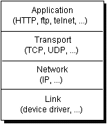
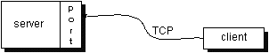
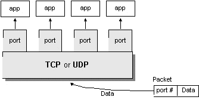

## 网络基础

在互联网上之间的通信交流，一般是基于 TCP  (Transmission Control Protocol，传输控制协议) 或者 UDP (User Datagram Protocol，用户数据报协议) ，如下图：

编写 Java 应用，我们只需关注于应用层 （application layer），而不用关心 TCP 和 UDP 所在的传输层是如何实现的。java.net 包含了你编程所需的类，这些类是与操作系统无关的。比如 URL, URLConnection, Socket, 和 ServerSocket 类是使用 TCP 连接网络的， DatagramPacket, DatagramSocket, 和 MulticastSocket 类是用于  UDP  的。

Java 支持的协议只有  TCP 和 UDP ，以及在建立在  TCP 和 UDP 之上其他应用层协议。所有其他传输层、网际层和更底层的协议，如 ICMP、IGMP、ARP、RARP、RSVP 和其他协议 在 Java 中只能链接到原生代码来实现。

## TCP

TCP (Transmission Control Protocol) 是面向连接的、提供端到端可靠的数据流(flow of data)。TCP 提供超时重发，丢弃重复数据，检验数据，流量控制等功能，保证数据能从一端传到另一端。 

“面向连接”就是在正式通信前必须要与对方建立起连接。这一过程与打电话很相似，先拨号振铃，等待对方摘机说“喂”，然后才说明是谁。

### 三次握手

TCP 是基于连接的协议，也就是说，在正式收发数据前，必须和对方建立可靠的连接。一个 TCP 连接必须要经过三次“握手”才能建立起来，简单的讲就是：

1. 主机 A 向主机 B 发出连接请求数据包：“我想给你发数据，可以吗？”；
2. 主机 B 向主机 A 发送同意连接和要求同步（同步就是两台主机一个在发送，一个在接收，协调工作）的数据包：“可以，你来吧”；
3. 主机 A 再发出一个数据包确认主机 B 的要求同步：“好的，我来也，你接着吧！”

三次“握手”的目的是使数据包的发送和接收同步，经过三次“对话”之后，主机 A 才向主机 B 正式发送数据。

可以详见[《TCP 协议的三次握手、四次分手》](http://www.waylau.com/tcp-connect-and-close/)

### 如何保证数据的可靠

TCP 通过下列方式来提供可靠性：

* 应用数据被分割成 TCP 认为最适合发送的数据块。这和 UDP 完全不同，应用程序产生的数据报长度将保持不变。由 TCP 传递给 IP 的信息单位称为报文段或段（segment）。
* 当 TCP 发出一个段后，它启动一个定时器，等待目的端确认收到这个报文段。如果不能及时收到一个确认，将重发这个报文段。（可自行了解 TCP 协议中自适应的超时及重传策略）。
* 当  TCP 收到发自  TCP 连接另一端的数据，它将发送一个确认。这个确认不是立即发送，通常将推迟几分之一秒。
*  TCP 将保持它首部和数据的检验和。这是一个端到端的检验和，目的是检测数据在传输过程中的任何变化。如果收到段的检验和有差错，  TCP 将丢弃这个报文段和不确认收到此报文段（希望发送端超时并重发）。
* 既然 TCP 报文段作为 IP 数据报来传输，而 IP 数据报的到达可能会失序，因此  TCP 报文段的到达也可能会失序。如果必要，  TCP 将对收到的数据进行重新排序，将收到的数据以正确的顺序交给应用层。
* 既然 IP 数据报会发生重复，  TCP 的接收端必须丢弃重复的数据。
* TCP 还能提供流量控制。TCP 连接的每一方都有固定大小的缓冲空间。 TCP 的接收端只允许另一端发送接收端缓冲区所能接纳的数据。这将防止较快主机致使较慢主机的缓冲区溢出。

## UDP

UDP (User Datagram Protocol) 不是面向连接的，主机发送独立的数据报（datagram）给其他主机，不保证数据到达。由于 UDP 在传输数据报前不用在客户和服务器之间建立一个连接，且没有超时重发等机制，故而传输速度很快。 

而无连接是一开始就发送信息（严格说来，这是没有开始、结束的），只是一次性的传递，是先不需要接受方的响应，因而在一定程度上也无法保证信息传递的可靠性了，就像写信一样，我们只是将信寄出去，却不能保证收信人一定可以收到。

### TCP 和 UDP 如何抉择

TCP 是面向连接的，有比较高的可靠性， 一些要求比较高的服务一般使用这个协议，如FTP、Telnet、SMTP、HTTP、POP3 等，而 UDP 是面向无连接的，使用这个协议的常见服务有 DNS、SNMP、QQ 等。对于 QQ 必须另外说明一下，QQ2003 以前是只使用UDP协议的，其服务器使用8000端口，侦听是否有信息传来，客户端使用 4000 端口，向外发送信息（这也就不难理解在一般的显IP的QQ版本中显示好友的IP地址信息中端口常为4000或其后续端口的原因了），即QQ程序既接受服务又提供服务，在以后的 QQ 版本中也支持使用 TCP 协议了。

## 端口

一般来说，一台计算机具有单个物理连接到网络。数据通过这个连接去往特定的计算机。然而，该数据可以被用于在计算机上运行的不同应用。那么，计算机知道哪个应用程序转发数据？通过使用端口。

在互联网上传输的数据是通过计算机的标识和端口来定位的。计算机的标识是 32-bit  的 IP 地址。端口由一个 16-bit 的数字。

在诸如面向连接的通信如 TCP，服务器应用将套接字绑定到一个特定端口号。这是向系统注册服务用来接受该端口的数据。然后，客户端可以在与服务器在服务器端口会合，如下图所示：

TCP 和 UDP 协议使用的端口来将接收到的数据映射到一个计算机上运行的进程。

在基于数据报的通信，如 UDP，数据报包中包含它的目的地的端口号，然后 UDP 将数据包路由到相应的应用程序，如本图所示的端口号：

端口号取值范围是从 0 到 65535 （16-bit 长度），其中范围从 0 到 1023 是受限的，它们是被知名的服务所保留使用，例如 HTTP （端口是 80）和 FTP （端口是20、21）等系统服务。这些端口被称为众所周知的端口（well-known ports）。您的应用程序不应该试图绑定到他们。你可以访问 <http://www.iana.org/assignments/service-names-port-numbers/service-names-port-numbers.xhtml> 来查询各种常用的已经分配的端口号列表。