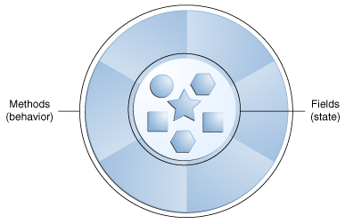
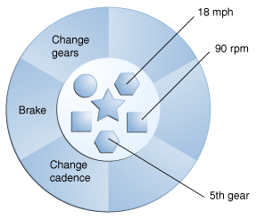
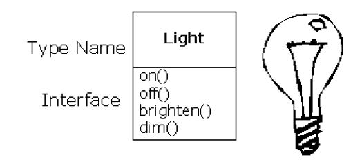
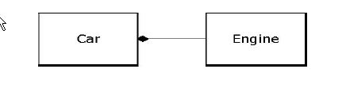
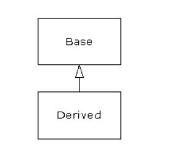
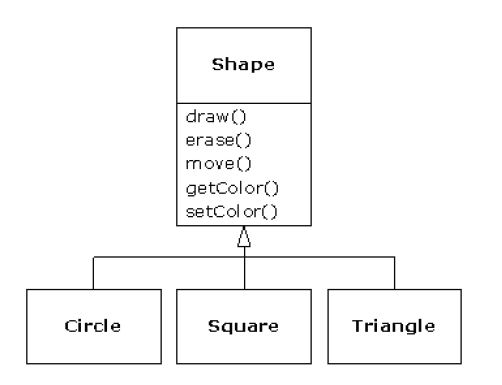
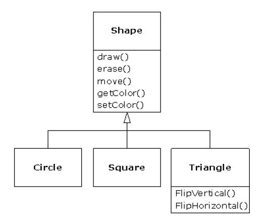
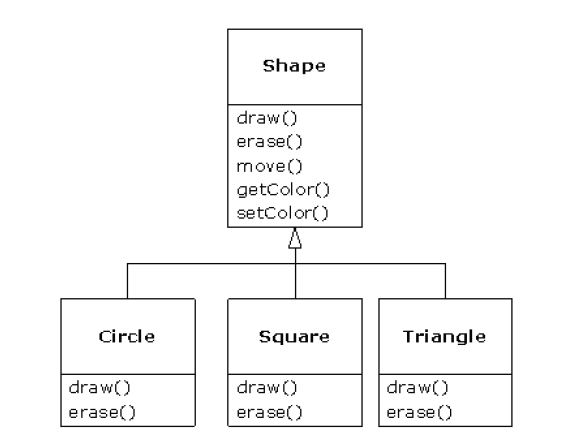
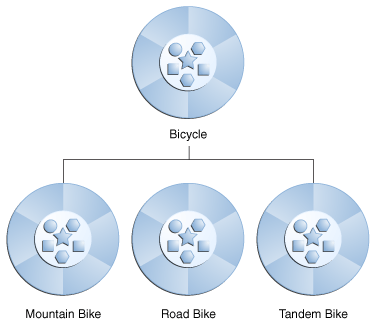
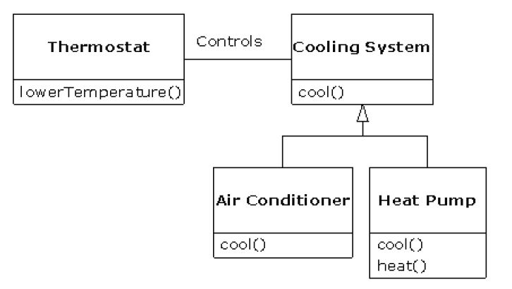

# 面向对象编程

## 编程的抽象

我们将问题空间中的元素以及它们在方案空间的表示物称作“对象”（Object）。当然，还有一些在问题空间没有对应体的其他对象。通过添加新的对象类型，程序可进行灵活的调整，以便与特定的问题配合。与现实世界的“对象”或者“物体”相比，编程“对
象”与它们也存在共通的地方：它们都有自己的状态(state)和行为(behavior)。比如，狗的状态有名字、颜色等，狗的行为有叫唤、摇尾等。



软件世界中的对象和现实世界中的对象类似，对象存储状态在字段（field）里，而通过方法（methods）暴露其行为。方法对对象的内部状态进行操作，并作为对象与对象之间通信主要机制。隐藏对象内部状态，通过方法进行所有的交互，这个面向对象编程的一个基本原则——数据封装（data encapsulation）。

以单车作为一个对象的建模为例:



通过状态（当前速度，当前踏板节奏，和当前档位），并提供改变这种状态的方法，对象仍然具有如何允许外面的世界使用的控制权。例如，如果自行车只有6个档位，一个方法来改变档位，是可以拒绝任何小于1或比6更大的值。

(1) 所有东西都是对象。可将对象想象成一种新型变量；它保存着数据，但可要求它对自身进行操作。理论上讲，可从要解决的问题身上提出所有概念性的组件，然后在程序中将其表达为一个对象。
(2) 程序是一大堆对象的组合；通过消息传递，各对象知道自己该做些什么。为了向对象发出请求，需向那个对象“发送一条消息”。更具体地讲，可将消息想象为一个调用请求，它调用的是从属于目标对象的一个子例程或函数。
(3) 每个对象都有自己的存储空间，可容纳其他对象。或者说，通过封装现有对象，可制作出新型对象。所以，尽管对象的概念非常简单，但在程序中却可达到任意高的复杂程度。
(4) 每个对象都有一种类型。根据语法，每个对象都是某个“类”的一个“实例”。其中，“类”（Class）是“类型”（Type）的同义词。一个类最重要的特征就是“能将什么消息发给它？”。
(5) 同一类所有对象都能接收相同的消息。由于类型为“圆”（Circle）的一个对象也属于类型为“形状”（Shape）的一个对象，所以一个圆完全能接收形状消息。这意味着可让程序代码统一指挥“形状”，令其自动控制所有符合“形状”描述的对象，其中自然包括
“圆”。这一特性称为对象的“可替换性”，是 OOP 最重要的概念之一。

### 类（Class）的示例

在现实世界中，你经常会发现许多单个对象是同类。有可能是存在其他成千上万的自行车，都是一样的品牌和型号。每个自行车都由相同的一组设计图纸而建成，并因此包含相同的组件。在面向对象的术语，我们说你的自行车被称为自行车对象类（class of objects）的实例（instance）。类就是创建单个对象的设计图纸。

下面是一个 Bicycle (自行车)类的实现：

```java
class Bicycle {

    int cadence = 0;
    int speed = 0;
    int gear = 1;

    void changeCadence(int newValue) {
         cadence = newValue;
    }

    void changeGear(int newValue) {
         gear = newValue;
    }

    void speedUp(int increment) {
         speed = speed + increment;   
    }

    void applyBrakes(int decrement) {
         speed = speed - decrement;
    }

    void printStates() {
         System.out.println("cadence:" +
             cadence + " speed:" + 
             speed + " gear:" + gear);
    }
}
```

字段 cadence, speed, 和 gear 是对象的状态，方法 changeCadence, changeGear, speedUp 定义了与外界的交互。

你可能已经注意到，Bicycle 类不包含一个 main 方法。这是因为它不是一个完整的应用程序。这是自行车的设计图纸，可能会在应用程序中使用。创建和使用新的 Bicycle对象是应用程序中的其他类的责任。

下面是 BicycleDemo 类，创建两个单独的 Bicycle 对象，并调用其方法：

```java
class BicycleDemo {
	/**
	 * @param args
	 */
	public static void main(String[] args) {
		 // Create two different 
        // Bicycle objects
        Bicycle bike1 = new Bicycle();
        Bicycle bike2 = new Bicycle();

        // Invoke methods on 
        // those objects
        bike1.changeCadence(50);
        bike1.speedUp(10);
        bike1.changeGear(2);
        bike1.printStates();

        bike2.changeCadence(50);
        bike2.speedUp(10);
        bike2.changeGear(2);
        bike2.changeCadence(40);
        bike2.speedUp(10);
        bike2.changeGear(3);
        bike2.printStates();

	}

}
```

执行程序，输出为：

```
cadence:50 speed:10 gear:2
cadence:40 speed:20 gear:3
```

### 源码

该例子可以在 `com.waylau.essentialjava.object.biycledemo` 包下找到。


## 对象的接口（Interface）

所有对象——尽管各有特色——都属于某一系列对象的一部分，这些对象具有通用的特征和行为。

每个对象仅能接受特定的请求。我们向对象发出的请求是通过它的“接口”（Interface）定义的，对象的“类型”或“类”则规定了它的接口形式。“类型”与“接口”的等价或对应关系是面向对象程序设计的基础。



```java
Light lt = new Light();
lt.on();
```

在这个例子中，类型／类的名称是 Light，Light 对象的名称是 lt ,可向 Light 对象发出的请求包括打开（on）、关闭（off）、变得更明亮（brighten ）或者变得更暗淡（dim）。通过简单地定义一个“引用（reference）”（lt），我们创建了一个 Light 对象，并用 new 关键字来请求那个类新建的对象。为了向对象发送一条消息，我们列出对象名（lt），再用一个句点符号（.）把它同消息名称（on）连接起来。从中可以看出，使用一些预先定义好的类时，我们在程序里采用的代码是非常简单和直观的。

### 接口的示例

对应自行车的行为，可以定义如下接口：

```java
interface Bicycle {

	// wheel revolutions per minute
	void changeCadence(int newValue);

	void changeGear(int newValue);

	void speedUp(int increment);

	void applyBrakes(int decrement);
}
```

实现该接口的类 ACMEBicycle，使用 implements 关键字：

```java
class ACMEBicycle implements Bicycle {

	int cadence = 0;
	int speed = 0;
	int gear = 1;

	// The compiler will now require that methods
	// changeCadence, changeGear, speedUp, and applyBrakes
	// all be implemented. Compilation will fail if those
	// methods are missing from this class.

	/*
	 * (non-Javadoc)
	 * 
	 * @see
	 * com.waylau.essentialjava.interfaceBicycleDemo.Bicycle#changeCadence(int)
	 */
	@Override
	public void changeCadence(int newValue) {
		// TODO Auto-generated method stub

	}

	/*
	 * (non-Javadoc)
	 * 
	 * @see
	 * com.waylau.essentialjava.interfaceBicycleDemo.Bicycle#changeGear(int)
	 */
	@Override
	public void changeGear(int newValue) {
		// TODO Auto-generated method stub

	}

	/*
	 * (non-Javadoc)
	 * 
	 * @see com.waylau.essentialjava.interfaceBicycleDemo.Bicycle#speedUp(int)
	 */
	@Override
	public void speedUp(int increment) {
		// TODO Auto-generated method stub

	}

	/*
	 * (non-Javadoc)
	 * 
	 * @see
	 * com.waylau.essentialjava.interfaceBicycleDemo.Bicycle#applyBrakes(int)
	 */
	@Override
	public void applyBrakes(int decrement) {
		// TODO Auto-generated method stub

	}
```

**注：** 接口的实现方法前必须添加 public 关键字

### 源码

该例子可以在 `com.waylau.essentialjava.object.interfacebiycledemo` 包下找到。

## 包（Package）

包是组织相关的类和接口的命名空间。从概念上讲，类似于计算机上的文件夹，用来将各种文件进行分类。

Java 平台提供了一个巨大的类库（包的集合），该库被称为“应用程序接口”，或简称为“API”。其包代表最常见的与通用编程相关的任务。例如，一个 String 对象包含了字符串的状态和行为; File 对象允许程序员轻松地创建，删除，检查，比较，或者修改文件系统中的文件; Socket 对象允许创建和使用网络套接字;各种 GUI 对象创建图形用户界面。从字面上有数以千计的课程可供选择。作为开发人员只需要专注于特定的应用程序的设计即可，而不是从基础设施建设开始。

## 对象提供服务

当设计一个程序时，需要将对象想象成一个服务的供应商。对象提供服务给用户，解决不同的问题。

比如，在设计一个图书管理软件，你可能设想一些对象包含了哪些预定义输入，其他对象可能用于图书的统计，一个对象用于打印的校验等。这都需要将一个问题分解成一组对象。

将对象的思考作为服务供应商有一个额外的好处：它有助于改善对象的凝聚力。高内聚（High cohesion） 是软件设计的基本质量：这意味着，一个软件组件的各方面（如对象，尽管这也可以适用于一个方法或一个对象的库）“结合在一起”。在设计对象时经常出现的问题是将太多的功能合并到一个对象里面。例如，在您的支票打印模块，你可以决定你需要知道所有有关格式和打印的对象。你可能会发现，这对于一个对象来说有太多的内容了，那你需要三个或三个以上的对象。一个对象用于查询有关如何打印一张支票的信息目录。一个对象或一组对象可以是知道所有不同类型的打印机的通用打印接口。第三个对象可以使用其他两个对象的服务来完成任务。因此，每个对象都有一套它提供的有凝聚力的服务。良好的面向对象设计，每个对象做好一件事，但不会尝试做太多。

将对象作为服务供应商是一个伟大的简化工具。这不仅在设计过程中是非常有用的，也在当别人试图理解你的代码或重用的对象。如果能看到根据它提供什么样的服务获得对象的值，它可以更容易适应它到设计中。

## 隐藏实现的细节

为方便后面的讨论，让我们先对这一领域的从业人员作一下分类。从根本上说，大致有两方面的人员涉足面向对象的编程：“类创建者”（创建新数据类型的人）以及“客户程序员”（在自己的应用程序中采用现成数据类型的人）。对客户程序员来讲，最主要的目标就是收集一个充斥着各种类的编程“工具箱”，以便快速开发符合自己要求的应用。而对类创建者来说，他们的目标则是从头构建一个类，只向客户程序员开放有必要开放的东西（接口），其他所有细节都隐藏起来。为什么要这样做？隐藏之后，客户程序员就不能接触和改变那些细节，所以原创者不用担心自己的作品会受到非法修改，可确保它们不会对其他人造成影响。

“接口”（Interface）规定了可对一个特定的对象发出哪些请求。然而，必须在某个地方存在着一些代码，以便满足这些请求。这些代码与那些隐藏起来的数据便叫作“隐藏的实现”。一种类型含有与每种可能的请求关联起来的函数。一旦向对象发出一个特定的请求，就会调用那个函数。我们通常将这个过程总结为向对象“发送一条消息”（提出一个请求）。对象的职责就是决定如何对这条消息作出反应（执行相应的代码）。对于任何关系，重要一点是让牵连到的所有成员都遵守相同的规则。创建一个库时，相当于同客户程序员建立了一种关系。对方也是程序员，但他们的目标是组合出一个特定的应用（程序），或者用您的库构建一个更大的库。

若任何人都能使用一个类的所有成员，那么客户程序员可对那个类做任何事情，没有办法强制他们遵守任何约束。即便非常不愿客户程序员直接操作类内包含的一些成员，但倘若未进行访问控制，就没有办法阻止这一情况的发生——所有东西都会暴露无遗。

有两方面的原因促使我们控制对成员的访问。第一个原因是防止程序员接触他们不该接触的东西——通常是内部数据类型的设计思想。若只是为了解决特定的问题，用户只需操作接口即可，毋需明白这些信息。我们向用户提供的实际是一种服务，因为他们很容易就可看出哪些对自己非常重要，以及哪些可忽略不计。

进行访问控制的第二个原因是允许库设计人员修改内部结构，不用担心它会对客户程序员造成什么影响。例如，我们最开始可能设计了一个形式简单的类，以便简化开发。以后又决定进行改写，使其更快地运行。若接口与实现方法早已隔离开，并分别受到保护，就可以很简单的处理。

Java 采用三个显式关键字以及一个隐式关键字来设置类边界：public，private，protected 以及暗示性的 friendly。若未明确指定其他关键字，则默认为后者。friendly 有时也被称为 default。这些关键字的使用和含义都是相当直观的，它们决定了谁能使用后续的定义内容。“public”（公共）意味着后续的定义任何人均可使用。而在另一方面，“private”（私有）意味着除您自己、类型的创建者以及那个类型的内部函数成员，其他任何人都不能访问后续的定义信息。private 在您与客户程序员之间竖起了一堵墙。若有人试图访问私有成员，就会得到一个编译期错误。“friendly ”（友好的）涉及“包装”或“封装”（Package）的概念——即 Java 用来构建库的方法。若某样东西是“友好的”，意味着它只能在这个包的范围内使用，所以这一访问级别有时也叫作“包访问（package access）”。“protected”（受保护的）与“private”相似，只是一个继承的类可访问受保护的成员，但不能访问私有成员。继承的问题不久就要谈到。

作用域 | 当前类 | 同一 package | 子孙类 | 其他 package 
---- | ---- | ---- | ---- | ----
public | √ | √ | √ | √ 
protected | √ | √ | √ | × 
friendly | √ | √ | × | × 
private | √ | × | × | × 

## 实现的重用

创建并测试好一个类后，它应（从理想的角度）代表一个有用的代码单位。它要求较多的经验以及洞察力，这样才能使这个类有可能重复使用。

重用是面向对象的程序设计提供的最伟大的一种杠杆。

为重用一个类，最简单的办法是仅直接使用那个类的对象。但同时也能将那个类的一个对象置入一个新类。我们把这叫作“创建一个成员对象”。新类可由任意数量和类型的其他对象构成。这个概念叫作“组合（composition）”（若该组合是动态发生，则也成为“聚合（aggregation）”）——在现有类的基础上组合为一个新类。有时，我们也将组合称作“包含（has-a）”关系，比如“一辆车包含了一个变速箱”。



对象的组合具有极大的灵活性。新类的“成员对象”通常设为“私有”（Private），使用这个类的客户程序员不能访问它们。这样一来，我们可在不干扰客户代码的前提下，从容地修改那些成员。也可以在“运行期”更改成员，这进一步增大了灵活性。后面要讲到的“继承”并不具备这种灵活性，因为编译器必须对通过继承创建的类加以限制。

继承虽然重要，但作为新加入这新建类的时候，首先应考虑“组合”对象；这样做显得更加简单和灵活。利用对象的组合，我们的设计可保持清爽。

## 继承

我们费尽心思做出一种数据类型后，假如不得不又新建一种类型，令其实现大致相同的功能，那会是一件非常令人灰心的事情。但若能利用现成的数据类型，对其进行“克隆”，再根据情况进行添加和修改，情况就显得理想多了。“继承”正是针对这个目标而设计的。但继承并不完全等价于克隆。在继承过程中，若原始类（正式名称叫作基础类、超类或父类）发生了变化，修改过的“克隆”类（正式名称叫作派生类或者继承类或者子类）也会反映出这种变化。在 Java 语言中，继承是通过 extends 关键字实现的
使用继承时，相当于创建了一个新类。这个新类不仅包含了现有类型的所有成员（尽管private 成员被隐藏起来，且不能访问），但更重要的是，它复制了基础类的接口。也就是说，可向基础类的对象发送的所有消息亦可原样发给衍生类的对象。根据可以发送的消息，我们能知道类的类型。这意味着衍生类具有与基础类相同的类型！

由于基础类和派生类具有相同的接口，所以那个接口必须进行特殊的设计。也就是说，对象接收到一条特定的消息后，必须有一个“方法”能够执行。若只是简单地继承一个类，并不做其他任何事情，来自基础类接口的方法就会直接照搬到派生类。这意味着派生类的对象不仅有相同的类型，也有同样的行为，这一后果通常是我们不愿见到的。



有两种做法可将新得的派生类与原来的基础类区分开。第一种做法十分简单：为派生类添加新函数（功能）。这些新函数并非基础类接口的一部分。进行这种处理时，一般都是意识到基础类不能满足我们的要求，所以需要添加更多的函数。这是一种最简单、最基本的继承用法，大多数时候都可完美地解决我们的问题。然而，事先还是要仔细调查自己的基础类是否真的需要这些额外的函数。

尽管 extends 关键字暗示着我们要为接口“扩展”新功能，但实情并非肯定如此。为区分我们的新类，第二个办法是改变基础类一个现有函数的行为。我们将其称作“改善”那个函数。为改善一个函数，只需为衍生类的函数建立一个新定义即可。我们的目标是：“尽管使用的函数接口未变，但它的新版本具有不同的表现”。

针对继承可能会产生这样的一个争论：继承只能改善原基础类的函数吗？若答案是肯定的，则派生类型就是与基础类完全相同的类型，因为都拥有完全相同的接口。这样造成的结果就是：我们完全能够将派生类的一个对象换成基础类的一个对象！可将其想象成一种“纯替换”。在某种意义上，这是进行继承的一种理想方式。此时，我们通常认为基础类和派生类之间存在一种“等价”关系——因为我们可以理直气壮地说：“圆就是一种几何形状”。为了对继承进行测试，一个办法就是看看自己是否能把它们套入这种“等价”关系中，看看是否有意义。

但在许多时候，我们必须为派生类型加入新的接口元素。所以不仅扩展了接口，也创建了一种新类型。这种新类型仍可替换成基础类型，但这种替换并不是完美的，因为不可在基础类里访问新函数。我们将其称作“类似”关系；新类型拥有旧类型的接口，但也包含了其他函数，所以不能说它们是完全等价的。举个例子来说，让我们考虑一下制冷机的情况。假定我们的房间连好了用于制冷的各种控制器；也就是说，我们已拥有必要的“接口”来控制制冷。现在假设机器出了故障，我们把它换成一台新型的冷、热两用空调，冬天和夏天均可使用。冷、热空调“类似”制冷机，但能做更多的事情。由于我们的房间只安装了控制制冷的设备，所以它们只限于同新机器的制冷部分打交道。新机器的接口已得到了扩展，但现有的系统并不知道除原始接口以外的任何东西。

认识了等价与类似的区别后，再进行替换时就会有把握得多。尽管大多数时候“纯替换”已经足够，但您会发现在某些情况下，仍然有明显的理由需要在衍生类的基础上增添新功能。通过前面对这两种情况的讨论，相信大家已心中有数该如何做。

另外一个是 “shape” 示例，基本类型是 “shape”，每个 shape 都有尺寸、颜色、位置等。每个 shape 都可以画、清除、移动、上色等。特定 shape 的派生类型 circle, square, triangle 等，都可能有自己的特征和行为。例如，某些 shape 可以翻转，有些行为可能会有所不同，比如，当你要计算一个 shape 的面积。



你有2种方法来区分原来的基类和新派生类。第一个非常简单：你只需向派生类添加新的方法。这些新方法不是基类接口的一部分。这意味着基本类没有你所希望的方法，所以你增加了更多的方法。这个是简单而原始的继承使用，有时，你的问题的完美解决方案。然而，另一种可能性，你的基础类可能也需要这些额外的方法。在面向对象程序设计中，经常会出现这种发现和迭代。



虽然继承可能有时意味着（特别是 Java，继承的关键字就是“extends（扩展）”）你将添加新的方法到接口，这不一定总是对的。第二种更重要的方式来区分你的新类是改变现有基类方法的行为。这被称为方法“覆盖（overriding）”。



覆盖的方法，您只需为派生类中的方法创建一个新的定义。“使用的是相同的接口方法，但在新类型里做不同的事情”。

### 继承的示例

不同种类的对象往往有一定量的在共同点。例如，山地自行车(Mountain Bike)，公路自行车(Road Bike)和双人自行车(Tandem Bike)，所有的自行车都有共同的特点：当前目前的速度，当前踏板节奏，当前档位。然而，每一个还定义了额外的功能，使他们不同：双人自行车有两个座位和两套车把;公路自行车有下降车把;一些山地自行车有一个附加的链环，使得他们具有一个较低的齿轮比。

面向对象的编程允许类从其他类继承常用的状态和行为。在这个例子中，自行车(Bicycle)现在变成山地车，公路自行车和双人自行车的超类。在 Java 编程语言中，每一个类被允许具有一个直接超类，每个超具有无限数量的子类的潜力：



继承使用 extends 关键字：

```java
class MountainBike extends Bicycle {

    // new fields and methods defining 
    // a mountain bike would go here
}
```


## is-a 和 is-like-a 的关系

有个讨论是关于继承的：继承只应该重写基类方法（不添加基类中没有的新的方法）？这将意味着派生类完全是同一类的基类，因为它有完全相同的接口。作为一个结果，您可以完全用基类的对象替换派生类的对象。这可以被认为是纯粹的替代，它通常被称为替代原则。从这个意义上说，这是对待继承的理想方法。这个就是 is-a 关系，可以说，“圆是一种形状（A circle is a shape）”。这是对于测试确定一些类是否是 is-a 关系是非常有用的。

有时，必须将新的接口元素添加到派生类型，从而扩展接口。新的类型仍然可以被替换为基类型，但替换并不是完美的，因为你的新方法是不可从基类型访问的。这可以被描述为一个 islike-a 关系。新类型拥有旧类型的接口，但它也包含其他的方法，所以你不能真的说它是完全相同的。例如，考虑一个空调。假设你的房子与所有的冷却控制连接，也就是说，它有一个接口，允许你控制冷却。想象一下，空调坏了，你用一个热泵替换它，它可以加热和冷却。热泵像一个空调，但它可以做更多。因为你的房子的控制系统的设计只是为了控制冷却，它被限制在只能与新的对象的冷却部分通信。新对象的接口已扩展，但现有的系统不知道除了原始接口以外的任何事情。



当然，一旦你看到这个设计，就很清楚，基本的“冷却系统(cooling system)”是不够的，应该重新命名为“温度控制系统(temperature control system)”，这样也可以包括加热。然而，这个图是一个可以在现实世界中发生的例子。

替代原则这种方法（纯替代）不是唯一的方式，有时你必须向派生类的接口添加新的方法，使得设计更加合理。

## 多态性（Polymorphism）

### 什么是多态

面向对象的三大特性：封装、继承、多态。从一定角度来看，封装和继承几乎都是为多态而准备的。

多态的定义：指允许不同类的对象对同一消息做出响应。即同一消息可以根据发送对象的不同而采用多种不同的行为方式。（发送消息就是函数调用）

实现多态的技术称为：动态绑定（dynamic binding），是指在执行期间判断所引用对象的实际类型，根据其实际的类型调用其相应的方法。

多态的作用：消除类型之间的耦合关系。

现实中，关于多态的例子不胜枚举。比方说按下 F1 键这个动作，如果当前在 Word 下弹出的就是 Word 帮助；在 Windows 下弹出的就是 Windows 帮助和支持。同一个事件发生在不同的对象上会产生不同的结果。

多态存在的三个必要条件：

* 要有继承
* 要有重写
* 父类引用指向子类对象。

多态的好处：

1. 可替换性（substitutability）。多态对已存在代码具有可替换性。例如，多态对圆 Circle 类工作，对其他任何圆形几何体，如圆环，也同样工作。
2. 可扩充性（extensibility）。多态对代码具有可扩充性。增加新的子类不影响已存在类的多态性、继承性，以及其他特性的运行和操作。实际上新加子类更容易获得多态功能。例如，在实现了圆锥、半圆锥以及半球体的多态基础上，很容易增添球体类的多态性。
3. 接口性（interface-ability）。多态是超类通过方法签名，向子类提供了一个共同接口，由子类来完善或者覆盖它而实现的。图中超类 Shape 规定了两个实现多态的接口方法，computeArea() 以及 computeVolume()。子类，如 Circle 和 Sphere 为了实现多态，完善或者覆盖这两个接口方法。
4. 灵活性（flexibility）。它在应用中体现了灵活多样的操作，提高了使用效率。
5. 简化性（simplicity）。多态简化对应用软件的代码编写和修改过程，尤其在处理大量对象的运算和操作时，这个特点尤为突出和重要。


## 源码

本章例子的源码，可以在 `com.waylau.essentialjava.object` 包下找到。
