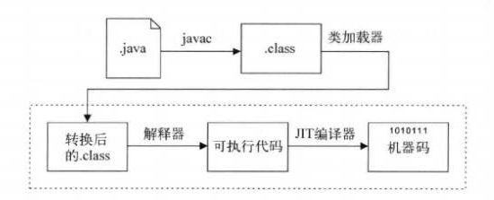

# Java 概述

Java 编程语言是一种通用的、并行的、基于类的、面向对象的语言。它被设计得非常简单，这样程序员可以在该语言上流畅的交流。Java 编程语言与 C 和 C++ 有关联，但组织却截然不同，其中也省略了其他语言的一些用法，比如指针。它的目的是作为一个生产性语言，而不是一个研究性语言，因此，在设计上避免了包括新的和未经考验的功能。

Java 编程语言是强类型和静态类型，可以在编译时检测到编译时错误。编译时间通常由翻译程序到与机器无关的字节码表示的。运行时的活动包括加载和执行程序，可选机器代码生成和程序的动态优化所需的类的交联，和实际执行程序。

Java 编程语言是一个比较高层次的语言，在机器表示的细节是无法通过该语言的。它包括自动存储管理，通常使用垃圾收集器，以避免明确释放的安全问题（就像 C 语言的 free  或 C++ 的 delete）。高性能垃圾回收的实现可具有有界的停顿，以支持系统的编程和实时应用。语言不包括任何不安全的结构，如没有索引检查的数组访问，因为这种不安全的结构会导致不可预知的程序行为。

其他让你选择 Java 的理由还包括：

* 丰富的开发工具：有很多开发工具可以让你快速开始 Java 编程之旅，比如 [Eclipse](https://eclipse.org/)、[IntelliJ](https://www.jetbrains.com/idea/) 和 [Netbeans](https://netbeans.org/)
* 庞大的社区： 在世界各地估计有[超过 9 百万的 Java 开发人员](https://plumbr.eu/blog/java/how-many-java-developers-in-the-world)。这个数字意味着 Java 开发者可选的能够提高自己能力的讨论会、书籍、在线资源、论坛及培训项目的数量是巨大的。在[最新的 TIOBE 编程语言排行榜](http://www.tiobe.com/index.php/content/paperinfo/tpci/index.html)中， Java 已经晋升榜首
* 快速发展的潜质：Oracle 在 [Java 8](http://www.oracle.com/technetwork/java/javase/overview/java8-2100321.html) 中引入 Lambda 表达式和 Streams。以及即将到来的 Java 9，我们预测 Java 的实用性将继续增加。
* 对于移动平台的支持：Android 的火爆很大一部分原因是因为 Java。在 Android 上，[ART](https://source.android.com/devices/tech/dalvik/) 为高负荷计算提供了接近本地应用的性能。在 iOS 上，[RoboVM](https://robovm.com/) 使用 [LLVM](http://llvm.org/)，其使用的是与 C/C++/Objective-C/Swift 相同的后端，提供了比 Objective-C 和 Swift 只高不低的性能。

## 语言起源
　　
Java平台和语言最开始只是SUN公司在1990年12月开始研究的一个内部项目。SUN公司的一个叫做帕特里克·诺顿的工程师被自己开发的C和C语言编译器搞得焦头烂额，因为其中的API极其难用。帕特里克决定改用NeXT，同时他也获得了研究公司的一个叫做“Stealth计划”的项目的机会。

“Stealth计划”后来改名为“Green计划”，JGosling（詹姆斯·高斯林）和麦克·舍林丹也加入了帕特里克的工作小组。他们和其他几个工程师一起在加利福尼亚州门罗帕克市沙丘路的一个小工作室里面研究开发新技术，瞄准下一代智能家电（如微波炉）的程序设计，SUN公司预料未来科技将在家用电器领域大显身手。团队最初考虑使用C语言，但是很多成员包括SUN的首席科学家比尔·乔伊，发现C和可用的API在某些方面存在很大问题。

工作小组使用的是内嵌类型平台，可以用的资源极其有限。很多成员发现C太复杂以至很多开发者经常错误使用。他们发现C缺少垃圾回收系统，还有可移植的安全性、分布程序设计、和多线程功能。最后，他们想要一种易于移植到各种设备上的平台。
　　
根据可用的资金，比尔·乔伊决定开发一种集C语言和Mesa语言搭成的新语言，在一份报告上，乔伊把它叫做“未来”，他提议SUN公司的工程师应该在C的基础上，开发一种面向对象的环境。最初，高斯林试图修改和扩展C的功能，他自己称这种新语言为C--，但是后来他放弃了。他将要创造出一种全新的语言，被他命名为“Oak”（橡树），以他的办公室外的树而命名。
　　
就像很多开发新技术的秘密的工程一样，工作小组没日没夜地工作到了1992年的夏天，他们能够演示新平台的一部分了，包括Green操作系统，Oak的程序设计语言，类库，和其硬件。最初的尝试是面向一种类PDA设备，被命名为Star7，这种设备有鲜艳的图形界面和被称为“Duke”的智能代理来帮助用户。1992年12月3日，这台设备进行了展示。
　　
同年11月，Green计划被转化成了“FirstPerson有限公司”，一个SUN公司的全资子公司，团队也被重新安排到了帕洛阿尔托。FirstPerson团队对建造一种高度互动的设备感兴趣，当时代华纳发布了一个关于电视机顶盒的征求提议书时（Requestforproposal），FirstPerson改变了他们的目标，作为对征求意见书的响应，提出了一个机顶盒平台的提议。但是有线电视业界觉得FirstPerson的平台给予用户过多地控制权，因此FirstPerson的投标败给了SGI。与3DO公司的另外一笔关于机顶盒的交易也没有成功，由于他们的平台不能在电视工业产生任何效益，公司再并回SUN公司。
　　
1994年6、7月间，在经历了一场历时三天的头脑风暴的讨论之后，约翰·盖吉、詹姆斯·高斯林、比尔·乔伊、帕特里克·诺顿、韦恩·罗斯因和埃里克·斯库米，团队决定再一次改变了努力的目标，这次他们决定将该技术应用于万维网。他们认为随着Mosaic浏览器的到来，因特网正在向同样的高度互动的远景演变，而这一远景正是他们在有线电视网中看到的。作为原型，帕特里克·诺顿写了一个小型万维网浏览器，WebRunner，后来改名为HotJava。同年，Oak改名为Java。商标搜索显示，Oak已被一家显卡制造商注册，因此团队找到了一个新名字。这个名字是在很多成员常去的本地咖啡馆中杜撰出来的。名字是不是首字母缩写还不清楚，很大程度上来说不是。虽然有人声称是开发人员名字的组合：JamesGosling（詹姆斯·高斯林）ArthurVanHoff（阿瑟·凡·霍夫）AndyBechtolsheim（安迪·贝克托克姆），或“JustAnotherVagueAcronym”（只是另外一个含糊的缩写）。还有一种比较可信的说法是这个名字是出于对咖啡的喜爱，所以以Java咖啡来命名。类文件的前四个字节如果用十六进制阅读的话，分别为“CAFEBABE”，就会拼出两个单词“CAFEBABE”（咖啡宝贝）。

　　
1994年10月，HotJava和Java平台为公司高层进行演示。1994年，Java1.0a版本已经可以提供下载，但是Java和HotJava浏览器的第一次公开发布却是在1995年5月23日SunWorld大会上进行的。SUN公司的科学指导约翰·盖吉宣告Java技术。这个发布是与网景公司的执行副总裁马克·安德森的惊人发布一起进行的，宣布网景将在其浏览器中包含对Java的支持。1996年1月，Sun公司成立了Java业务集团，专门开发Java技术。

## 发展简史

* 1995年5月23日，Java语言诞生
* 1996年1月，第一个JDK-JDK1.0诞生
* 1996年4月，10个最主要的操作系统供应商申明将在其产品中嵌入JAVA技术
* 1996年9月，约8.3万个网页应用了JAVA技术来制作
* 1997年2月18日，JDK1.1发布
* 1997年4月2日，JavaOne会议召开，参与者逾一万人，创当时全球同类会议规模之纪录
* 1997年9月，JavaDeveloperConnection社区成员超过十万
* 1998年2月，JDK1.1被下载超过2,000,000次
* 1998年12月8日，JAVA2企业平台J2EE发布
* 1999年6月，SUN公司发布Java的三个版本：标准版（JavaSE,以前是J2SE）、企业版（JavaEE以前是J2EE）和微型版（JavaME，以前是J2ME）
* 2000年5月8日，JDK1.3发布
* 2000年5月29日，JDK1.4发布
* 2001年6月5日，NOKIA宣布，到2003年将出售1亿部支持Java的手机
* 2001年9月24日，J2EE1.3发布
* 2002年2月26日，J2SE1.4发布，自此Java的计算能力有了大幅提升
* 2004年9月30日18:00PM，J2SE1.5发布，成为Java语言发展史上的又一里程碑。为了表示该版本的重要性，J2SE1.5更名为JavaSE5.0
* 2005年6月，JavaOne大会召开，SUN公司公开JavaSE6。此时，Java的各种版本已经更名，以取消其中的数字“2”：J2EE更名为JavaEE，J2SE更名为JavaSE，J2ME更名为JavaME
* 2006年12月，SUN公司发布JRE6.0
* 2009年4月7日GoogleAppEngine开始支持Java
* 2009年04月20日，甲骨文74亿美元收购Sun。取得java的版权。
* 2010年11月，由于甲骨文对于Java社区的不友善，因此Apache扬言将退出JCP。
* 2011年7月28日，甲骨文发布java7.0的正式版。
* 2014年3月19日，甲骨文公司发布java8.0的正式版。

## Java 语言与 Java 虚拟机的关系

### 什么是 Java 虚拟机

Java 虚拟机(Java Virtual Machine,简称 JVM) 是整个 Java 平台的基石，实现硬件与操作系统无关，编译代码后生成出极小体积，保障用户机器免于恶意代码损害。

JVM 可以看作是一台抽象的计算机。跟真实的计算机一样，它有自己的指令集以及各种运行时内存区域。使用虚拟机来实现一门程序设计语言有许多合理的理由，业界中流传最为久远的虚拟机可能是 UCSD Pascal 的 P-Code 虚拟机。

第一个 JVM 的原型机是由 Sun 公司实现的，它被用在一种类似 PDA（Personal Digital Assistant，俗称掌上电脑）的手持设备上仿真实现 JVM 指令集。时至今日，Oracle 已有许多 JVM 实现应用于移动设备、桌面电脑、服务器等领域。JVM 并不局限于特定的实现技术、主机硬件和操作系统。它不强求使用解释器来执行程序，也可以通过把自己的指令集编译为实际 CPU 的指令来实现，它可以通过微代码来实现，或者甚至直接实现在 CPU 中。

### Java 语言与 JVM 的关系

JVM 与 Java 语言并没有必然的联系，它只与特定的二进制文件格式 class 文件格式所关联。class 文件中包含了 JVM 指令集（或者称为字节码、bytecodes）和符号表，还有一些其他辅助信息。

基于安全方面的考虑，JVM 要求在 class 文件中使用了许多强制性的语法和结构化约束，但任一门功能性语言都可以表示为一个能被 JVM 接收的有效的 class 文件。作为一个通用的、机器无关的执行平台，任何其他语言的实现者都可以将 JVM 作为他们语言的产品交付媒介。

如上图所示，在 Java 编程语言和环境中，即时编译器（JIT compiler，just-in-time compiler）是一个把 Java 的字节码（包括需要被解释的指令的程序）转换成可以直接发送给处理器的指令的程序。当你写好一个 Java 程序后，源语言的语句将由Java 编译器编译成字节码，而不是编译成与某个特定的处理器硬件平台对应的指令代码（比如，Intel 的 Pentium 微处理器或 IBM 的 System/390 处理器）。字节码是可以发送给任何平台并且能在那个平台上运行的独立于平台的代码。

有关 JVNM 的相关内容，可参阅[《Java 虚拟机规范》](https://github.com/waylau/java-virtual-machine-specification) 。
