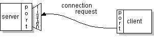
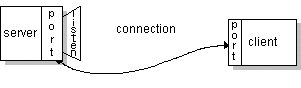

# Socket

##  什么是 Socket

Socket（套接字）：是在网络上运行两个程序之间的双向通信链路的一个端点。socket绑定到一个端口号，使得 TCP 层可以标识数据最终要被发送到哪个应用程序。

正常情况下，一台服务器在特定计算机上运行，​​并具有被绑定到特定端口号的 socket。服务器只是等待，并监听用于客户发起的连接请求的 socket 。

在客户端：客户端知道服务器所运行的主机名称以及服务器正在侦听的端口号。建立连接请求时，客户端尝试与主机服务器和端口会合。客户端也需要在连接中将自己绑定到本地端口以便于给服务器做识别。本地端口号通常是由系统分配的。



如果一切顺利的话，服务器接受连接。一旦接受，服务器获取绑定到相同的本地端口的新 socket ，并且还具有其远程端点设定为客户端的地址和端口。它需要一个新的socket，以便它可以继续监听原来用于客户端连接请求的 socket 。



在客户端，如果连接被接受，则成功地创建一个套接字和客户端可以使用该 socket 与服务器进行通信。

客户机和服务器现在可以通过 socket 写入或读取来交互了。

端点是IP地址和端口号的组合。每个 TCP 连接可以通过它的两个端点被唯一标识。这样，你的主机和服务器之间可以有多个连接。

java.net 包中提供了一个类 Socket，实现您的 Java 程序和网络上的其他程序之间的双向连接。 Socket 类隐藏任何特定系统的细节。通过使用 java.net.Socket 类，而不是依赖于原生代码，Java 程序可以用独立于平台的方式与网络进行通信。

此外，java.net 包含了 ServerSocket 类，它实现了服务器的 socket 可以侦监听和接受客户端的连接。下文将展示如何使用 Socket 和 ServerSocket 类。

## 实现一个 echo 服务器

让我们来看看这个例子，程序可以建立使用 Socket 类连接到服务器程序，客户端可以通过 socket 向服务器发送数据和接收数据。

EchoClient 示例程序实现了一个客户端，连接到回声服务器。回声服务器从它的客户端接收数据并原样返回回来。EchoServer 实现了 echo 服务器。 （客户端可以连接到支持 [Echo 协议](http://tools.ietf.org/html/rfc862)的任何主机）

EchoClient 创建一个 socket，从而得到回声服务器的连接。它从标准输入流中读取用户输入，然后通过 socket 转发该文本给回声服务器。服务器通过该 socket 将文本原样输入回给客户端。客户机程序读取并显示从服务器传递回给它的数据。

注意，EchoClient 例子既从 socket 写入又从 socket 中读取数据。
 
EchoClient 代码：

```java
public class EchoClient {
    public static void main(String[] args) throws IOException {
        
        if (args.length != 2) {
            System.err.println(
                "Usage: java EchoClient <host name> <port number>");
            System.exit(1);
        }

        String hostName = args[0];
        int portNumber = Integer.parseInt(args[1]);

        try (
            Socket echoSocket = new Socket(hostName, portNumber);
            PrintWriter out =
                new PrintWriter(echoSocket.getOutputStream(), true);
            BufferedReader in =
                new BufferedReader(
                    new InputStreamReader(echoSocket.getInputStream()));
            BufferedReader stdIn =
                new BufferedReader(
                    new InputStreamReader(System.in))
        ) {
            String userInput;
            while ((userInput = stdIn.readLine()) != null) {
                out.println(userInput);
                System.out.println("echo: " + in.readLine());
            }
        } catch (UnknownHostException e) {
            System.err.println("Don't know about host " + hostName);
            System.exit(1);
        } catch (IOException e) {
            System.err.println("Couldn't get I/O for the connection to " +
                hostName);
            System.exit(1);
        } 
    }
}
```

EchoServer 代码：

```java
public class EchoServer {
    public static void main(String[] args) throws IOException {
        
        if (args.length != 1) {
            System.err.println("Usage: java EchoServer <port number>");
            System.exit(1);
        }
        
        int portNumber = Integer.parseInt(args[0]);
        
        try (
            ServerSocket serverSocket =
                new ServerSocket(Integer.parseInt(args[0]));
            Socket clientSocket = serverSocket.accept();     
            PrintWriter out =
                new PrintWriter(clientSocket.getOutputStream(), true);                   
            BufferedReader in = new BufferedReader(
                new InputStreamReader(clientSocket.getInputStream()));
        ) {
            String inputLine;
            while ((inputLine = in.readLine()) != null) {
                out.println(inputLine);
            }
        } catch (IOException e) {
            System.out.println("Exception caught when trying to listen on port "
                + portNumber + " or listening for a connection");
            System.out.println(e.getMessage());
        }
    }
}
```

首先启动服务器，在命令行输入如下，设定一个端口号，比如 7（Echo 协议指定端口是 7）：

    java EchoServer 7
    
而后启动客户端，echoserver.example.com  是你主机的名称，如果是本机的话，主机名称可以是 localhost

    java EchoClient echoserver.example.com 7
    
输出效果如下：

    你好吗？
    echo: 你好吗？
    我很好哦
    echo: 我很好哦
    要过年了，www.waylau.com 祝你 猴年大吉，身体健康哦！
    echo: 要过年了，www.waylau.com 祝你 猴年大吉，身体健康哦！

