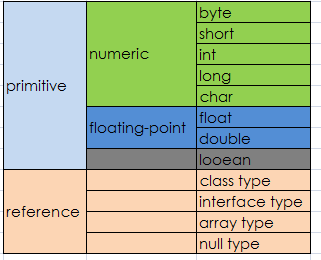
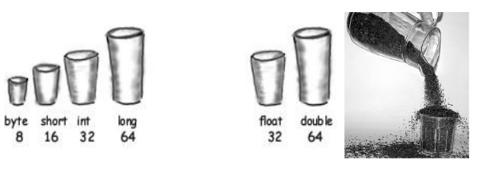
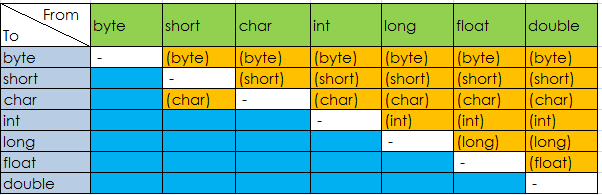

# 变量（Variable）


前文也介绍了，对象的状态是存储在字段里面

```java
int cadence = 0;
int speed = 0;
int gear = 1;
```

Java 里面的变量包含如下类型：

* 实例变量/非静态字段(Instance Variables/Non-Static Fields):从技术上讲，对象存储他们的个人状态在“非静态字段”，也就是没有 static 关键字声明的字段。非静态字段也被称为实例变量，因为它们的值对于类的每个实例来说是唯一的（换句话说，就是每个对象）; 自行车的当前速度​独立于另一辆自行车的当前速度​。
* 类变量/静态字段(Class Variables/Static Fields) ：类变量是用 static 修饰符声明的字段，也就是告诉编译器无论类被实例化多少次，这个变量的存在，只有一个副本。特定种类自行车的齿轮数目的字段可以被标记为 static，因为相同的齿轮数量将适用于所有情况。代码`static int numGears = 6;`将创建一个这样的静态字段。此外，关键字 final 也可以加入，以指示的齿轮的数量不会改变。
* 局部变量(Local Variables)：类似于对象存储状态在字段里，方法通常会存放临时状态在局部变量里。语法与局部变量的声明类似（例如，`int count = 0;`）。没有特殊的关键字来指定一个变量是否是局部变量，是由该变量声明的位置决定的。局部变量是类的方法中的变量。
* 参数（Parameters）：前文的例子中经常可以看到`public static void main(String[] args)`，这里的 args 变量就是这个方法参数。要记住的重要一点是，参数都归类为“变量（variable）”而不是“字段（field）”。

如果我们谈论的是“一般的字段”（不包括局部变量和参数），我们可以简单地说“字段”。如果讨论适用于上述所有情况，我们可以简单地说“变量”。如果上下文要求一个区别，我们将使用特定的术语（静态字段，局部变量，等等）。你也偶尔会看到使用术语“成员（member）”。 类型的字段、方法和嵌套类型统称为它的成员。

## 命名

每一个编程语言都有它自己的一套规则和惯例的各种名目的，Java 编程语言对于命名变量的规则和惯例可以概括如下：

* 变量名称是区分大小写的。变量名可以是任何合法的标识符 - 无限长度的 Unicode字母和数字，以字母，美元符号`$`，或下划线`_`开头。但是惯例上推荐使用字母开头，而不是`$`或`_`。此外，按照惯例，美元符号从未使用过的。您可能会发现一些情况，自动生成的名称将包含美元符号，但你的变量名应该始终避免使用它。类似的约定存在下划线，不鼓励用“_”作为变量名开头。空格是不允许的。
* 随后的字符可以是字母，数字，美元符号，或下划线字符。惯例同样适用于这一规则。为变量命名，尽量是完整的单词，而不是神秘的缩写。这样做会使你的代码更容易阅读和理解，比如  cadence、speed 和 gear 会比缩写 c、s 和 g 更直观。同时请记住，您选择的名称不能是[关键字或保留字](../docs/keywords.md)。
* 如果您选择的名称只包含一个词，拼写单词全部小写字母。如果它由一个以上的单词，每个后续单词的第一个字母大写，如 gearRatio 和 currentGear。如果你的变量存储一个恒定值，使用`static final int NUM_GEARS = 6`，每个字母大写，并用以下划线分隔后续字符。按照惯例，下划线字符永远不会在其他地方使用。

详细的命名规范，可以参考《[Java 编码规范](<https://github.com/waylau/java-code-conventions>)》。

## 基本数据类型（Primitive Data Types）

Java 是静态类型（statically-typed）的语言，必须先声明再使用。基本数据类型之间不会共享状态。

主要有8种基本数据类型：



#### byte

byte 由1个字节8位表示，是最小的整数类型。主要用于节省内存空间关键。当操作来自网络、文件或者其他 IO 的数据流时，byte类型特别有用。取值范围为:[-128, 127]. byte 的默认值为 (byte)0,如果我们试图将取值范围外的值赋给 byte类型变量，则会出现编译错误，例如 `byte b = 128；`这个语句是无法通过编译的。一个有趣的问题，如果我们有个方法： public void test(byte b)。试图这么调用这个方法是错误的: test(0); 编译器会报错，类型不兼容！！！我们记得`byte b =0；`这是完全没有问题的，为什么在这里就出错啦？

这里涉及到一个叫字面值（literal）的问题，字面值就是表面上的值，例如整型字面值在源代码中就是诸如 5 ， 0， -200这样的。如果整型子面子后面加上L或者l，则这个字面值就是 long 类型，比如：1000L代表一个 long 类型的值。如果不加L或者l，则为 int 类型。基本类型当中的byte short int long都可以通过不加L的整型字面值（我们就称作int字面值吧）来创建，例如 byte b = 100； short s = 5；对于long类型，如果大小超出int所能表示的范围（32 bits），则必须使用L结尾来表示。整型字面值可以有不同的表示方式：16进制【0X or 0x】、10进制【nothing】、八进制【0】、2进制【0B or 0b】等，二进制字面值是JDK 7以后才有的功能。在赋值操作中，int字面值可以赋给byte short int long，Java语言会自动处理好这个过程。如果方法调用时不一样，调用test（0）的时候，它能匹配的方法是test（int），当然不能匹配test（byte）方法，至于为什么Java没有像支持赋值操作那样支持方法调用，不得而知。注意区别包装器与原始类型的自动转换（anto-boxing，auto-unboxing）。`byte d = 'A'；`也是合法的，字符字面值可以自动转换成16位的整数。
对byte类型进行数学运算时，会自动提升为int类型，如果表达式中有double或者float等类型，也是自动提升。所以下面的代码是错误的：

```java
byte t s1 = 100;
byte s2 = 'a';
byte sum = s1 + s2;//should cast by (byte)
```

#### short

用 16 位表示，取值范围为：[- 2^15, 2^15 - 1]。short可能是最不常用的类型了。可以通过整型字面值或者字符字面值赋值，前提是不超出范围（16 bit）。short类型参与运算的时候，一样被提升为int或者更高的类型。（顺序为 byte short int long float double).

#### int

32 bits, [- 2^31, 2^31 - 1].有符号的二进制补码表示的整数。常用语控制循环，注意byte 和 short在运算中会被提升为int类型或更高。Java 8以后，可以使用int类型表示无符号32位整数[ 0, 2^31 - 1]。

#### long

64 bits， [- 2^63, 2^63 - 1,默认值为0L].当需要计算非常大的数时，如果int不足以容纳大小，可以使用long类型。如果long也不够，可以使用BigInteger类。

#### char

16 bits, [0, 65535], [0, 2^16 -1],从'\u0000'到'\uffff'。无符号，默认值为'\u0000'。Java使用Unicode字符集表示字符，Unicode是完全国际化的字符集，可以表示全部人类语言中的字符。Unicode需要16位宽，所以Java中的char类型也使用16 bit表示。 赋值可能是这样的：

```java
char ch1 = 88;
char ch2 = 'A';
```

ASCII字符集占用了Unicode的前127个值。之所以把char归入整型，是因为Java为char提供算术运算支持，例如可以ch2++;之后ch2就变成Y。当char进行加减乘除运算的时候，也被转换成int类型，必须显式转化回来。

#### float

使用32 bit表示，对应单精度浮点数，遵循IEEE 754规范。运行速度相比double更快，占内存更小，但是当数值非常大或者非常小的时候会变得不精确。精度要求不高的时候可以使用float类型，声明赋值示例：

```java
float f1 =10;  
f1 = 10L;  
f1 = 10.0f;  //f1 = 10.0;默认为double
```

可以将byte、short、int、long、char赋给float类型，java自动完成转换。

#### double

64为表示，将浮点子面子赋给某个变量时，如果不显示在字面值后面加f或者F，则默认为double类型。java.lang.Math中的函数都采用double类型。

如果double和float都无法达到想要的精度，可以使用BigDecimal类。

#### boolean

boolean类型只有两个值true和false，默认为false。boolean与是否为0没有任何关系，但是可以根据想要的逻辑进行转换。许多地方都需要用到boolean类型。

除了上面列出的八种原始数据类型，Java 编程语言还提供了 [java.lang.String](https://docs.oracle.com/javase/8/docs/api/java/lang/String.html)用于字符串的特殊支持。双引号包围的字符串会自动创建一个新的 String 对象，例如`String s = "this is a string";`。String 对象是不可变的（immutable），这意味着一旦创建，它们的值不能改变。 String 类不是技术上的原始数据类型，但考虑由语言所赋予的特殊支持，你可能会倾向于认为它是这样的。更多关于 String 类的细节，可以参阅[简单数据对象（Simple Data Objects）]()。


#### 默认值

在字段声明时，有时并不必要分配一个值。字段被声明但尚未初始化时，将会由编译器设置一个合理的默认值。一般而言，根据数据类型此的不同，默认将为零或为 null。但良好的的编程风格不应该依赖于这样默认值。

下面的图表总结了上述数据类型的默认值。

数据类型 | 字段默认值
---- | ----
byte	| 0
short	| 0
int	| 0
long	| 0L
float	| 0.0f
double	| 0.0d
char	| '\u0000'
String (或任何对象) | null
boolean	| false

局部变量（Local Variable）略有不同，编译器不会指定一个默认值未初始化的局部变量。如果你不能初始化你声明的局部变量，那么请确保使用之前，给它分配一个值。访问一个未初始化的局部变量会导致编译时错误。

## 字面值（Literal）

在 Java 源代码中，字面值用于表示固定的值（fixed value），直接展示在代码里，而不需要计算。数值型的字面值是最常见的，字符串字面值可以算是一种，当然也可以把特殊的 null 当做字面值。字面值大体上可以分为整型字面值、浮点字面值、字符和字符串字面值、特殊字面值。

### 整型字面值

从形式上看是整数的字面值归类为整型字面值。例如： 10, 100000L, 'B'、0XFF这些都可以称为字面值。整型字面值可以用十进制、16、8、2进制来表示。十进制很简单，2、8、16进制的表示分别在最前面加上0B（0b）、0、0X（0x）即可，当然基数不能超出进制的范围，比如09是不合法的，八进制的基数只能到7。一般情况下，字面值创建的是int类型，但是int字面值可以赋值给byte short char long int，只要字面值在目标范围以内，Java会自动完成转换，如果试图将超出范围的字面值赋给某一类型（比如把128赋给byte类型），编译通不过。而如果想创建一个int类型无法表示的long类型，则需要在字面值最后面加上L或者l。通常建议使用容易区分的L。所以整型字面值包括int字面值和long字面值两种。

* 十进制(Decimal)：其位数由数字0〜9组成;这是您每天使用的数字系统
* 十六进制(Hexadecimal)：其位数由数字0到9和字母A至F的组成
* 二进制(Binary)：其位数由数字0和1的（可以在 Java SE 7 和更高版本创建二进制字面值）

下面是使用的语法：

```java
// The number 26, in decimal
int decVal = 26;
//  The number 26, in hexadecimal
int hexVal = 0x1a;
// The number 26, in binary
int binVal = 0b11010;
```

### 浮点字面值

浮点字面值简单的理解可以理解为小数。分为float字面值和double字面值，如果在小数后面加上F或者f，则表示这是个float字面值，如11.8F。如果小数后面不加F（f），如10.4。或者小数后面加上D（d），则表示这是个double字面值。另外，浮点字面值支持科学技术法( E 或 e )表示。下面是一些例子：

```java
double d1 = 123.4;
// same value as d1, but in scientific notation
double d2 = 1.234e2;
float f1  = 123.4f;
```

### 字符及字符串字面值

Java 中字符字面值用单引号括起来，如`@`，`1`。所有的UTF-16字符集都包含在字符字面值中。不能直接输入的字符，可以使用转义字符，如`\n`为换行字符。也可以使用八进制或者十六进制表示字符，八进制使用反斜杠加3位数字表示，例如`\141`表示字母a。十六进制使用`\u`加上4为十六进制的数表示，如`\u0061`表示字符a。也就是说，通过使用转义字符，可以表示键盘上的有的或者没有的所有字符。常见的转义字符序列有：

`\ddd(八进制) `、 `\uxxxx(十六进制Unicode字符)`、`\'（单引号）`、`\"（双引号）`、`\\ （反斜杠）\r（回车符） \n（换行符） \f（换页符） \t（制表符） \b（回格符）`

字符串字面值则使用双引号，字符串字面值中同样可以包含字符字面值中的转义字符序列。字符串必须位于同一行或者使用+运算符，因为 Java 没有续行转义序列。

### 在数值型字面值中使用下划线

Java SE 7 开始，可以在数值型字面值中使用下划线。但是下划线只能用于分隔数字，不能分隔字符与字符，也不能分隔字符与数字。例如 `int x = 123_456_789`，在编译的时候，下划线会自动去掉。可以连续使用下划线，比如`float f = 1.22___33__44`。二进制或者十六进制的字面值也可以使用下划线，记住一点，下划线只能用于数字与数字之间，初次以外都是非法的。例如1._23是非法的，_123、11000_L都是非法的。

正确的用法：

```java
long creditCardNumber = 1234_5678_9012_3456L;
long socialSecurityNumber = 999_99_9999L;
float pi =  3.14_15F;
long hexBytes = 0xFF_EC_DE_5E;
long hexWords = 0xCAFE_BABE;
long maxLong = 0x7fff_ffff_ffff_ffffL;
byte nybbles = 0b0010_0101;
long bytes = 0b11010010_01101001_10010100_10010010;
```

非法的用法：

```java
// Invalid: cannot put underscores
// adjacent to a decimal point
float pi1 = 3_.1415F;
// Invalid: cannot put underscores 
// adjacent to a decimal point
float pi2 = 3._1415F;
// Invalid: cannot put underscores 
// prior to an L suffix
long socialSecurityNumber1 = 999_99_9999_L;

// Invalid: cannot put underscores
// At the end of a literal
int x2 = 52_;

// Invalid: cannot put underscores
// in the 0x radix prefix
int x4 = 0_x52;
// Invalid: cannot put underscores
// at the beginning of a number
int x5 = 0x_52;
// Invalid: cannot put underscores
// at the end of a number
int x7 = 0x52_;
```

## 基本类型之间的转换

我们看到，将一种类型的值赋给另一种类型是很常见的。在 Java 中，boolean 类型与所有其他7种类型都不能进行转换，这一点很明确。对于其他7中数值类型，它们之间都可以进行转换，但是可能会存在精度损失或者其他一些变化。转换分为自动转换和强制转换。对于自动转换（隐式），无需任何操作，而强制类型转换需要显式转换，即使用转换操作符（type）。首先将7种类型按下面顺序排列一下：

```
byte <（short=char）< int < long < float < double
```

如果从小转换到大，可以自动完成，而从大到小，必须强制转换。short 和 char 两种相同类型也必须强制转换。



### 自动转换

自动转换时发生扩宽（widening conversion）。因为较大的类型（如int）要保存较小的类型（如byte），内存总是足够的，不需要强制转换。如果将字面值保存到 byte、short、char、long 的时候，也会自动进行类型转换。注意区别，此时从 int（没有带L的整型字面值为int）到 byte/short/char 也是自动完成的，虽然它们都比int 小。在自动类型转化中，除了以下几种情况可能会导致精度损失以外，其他的转换都不能出现精度损失。

* int--> float
* long--> float
* long--> double
* float -->double without strictfp

除了可能的精度损失外，自动转换不会出现任何运行时（run-time）异常。

### 强制类型转换

如果要把大的转成小的，或者在 short 与 char 之间进行转换，就必须强制转换，也被称作缩小转换（narrowing conversion）,因为必须显式地使数值更小以适应目标类型。强制转换采用转换操作符（）。严格地说，将 byte 转为 char 不属于 （narrowing conversion），因为从 byte 到 char 的过程其实是 byte-->int-->char，所以 widening 和 narrowing 都有。强制转换除了可能的精度损失外，还可能使模（overall magnitude）发生变化。强制转换格式如下：
（target-type） value

```java
int a=257;   
byte b;   
b = (byte)a;//1
```

如果整数的值超出了 byte 所能表示的范围，结果将对 byte 类型的范围取余数。例如a=256超出了byte的[-128,127]的范围，所以将257除以byte的范围（256）取余数得到b=1；需要注意的是，当a=200时，此时除了256取余数应该为-56，而不是200.
将浮点类型赋给整数类型的时候，会发生截尾（truncation）。也就是把小数的部分去掉，只留下整数部分。此时如果整数超出目标类型范围，一样将对目标类型的范围取余数。

7中基本类型转换总结如下图：



### 赋值及表达式中的类型转换：

#### 字面值赋值

在使用字面值对整数赋值的过程中，可以将int literal赋值给byte short char int，只要不超出范围。这个过程中的类型转换时自动完成的，但是如果你试图将long literal赋给byte，即使没有超出范围，也必须进行强制类型转换。例如 byte b = 10L；是错的，要进行强制转换。

#### 表达式中的自动类型提升

除了赋值以外，表达式计算过程中也可能发生一些类型转换。在表达式中，类型提升规则如下：

* 所有byte/short/char都被提升为int。
* 如果有一个操作数为long，整个表达式提升为long。float和double情况也一样。

## 数组（Array）

数组是一个容器对象，保存一个固定数量的单一类型的值。当数组创建时，数组的长度就确定了。创建后，其长度是固定的。下面是一个例子：


数据里面的每个项称为元素（element），每个元素都用一个数组下标（index）关联，下标是从 0 开始，如上图所示，第9个元素的下标是 8：

ArrayDemo 的示例：

```java
class ArrayDemo {
	/**
	 * @param args
	 */
	public static void main(String[] args) {
		// declares an array of integers
		int[] anArray;

		// allocates memory for 10 integers
		anArray = new int[10];

		// initialize first element
		anArray[0] = 100;
		// initialize second element
		anArray[1] = 200;
		// and so forth
		anArray[2] = 300;
		anArray[3] = 400;
		anArray[4] = 500;
		anArray[5] = 600;
		anArray[6] = 700;
		anArray[7] = 800;
		anArray[8] = 900;
		anArray[9] = 1000;

		System.out.println("Element at index 0: " + anArray[0]);
		System.out.println("Element at index 1: " + anArray[1]);
		System.out.println("Element at index 2: " + anArray[2]);
		System.out.println("Element at index 3: " + anArray[3]);
		System.out.println("Element at index 4: " + anArray[4]);
		System.out.println("Element at index 5: " + anArray[5]);
		System.out.println("Element at index 6: " + anArray[6]);
		System.out.println("Element at index 7: " + anArray[7]);
		System.out.println("Element at index 8: " + anArray[8]);
		System.out.println("Element at index 9: " + anArray[9]);
	}
}
```

输出为：

```
Element at index 0: 100
Element at index 1: 200
Element at index 2: 300
Element at index 3: 400
Element at index 4: 500
Element at index 5: 600
Element at index 6: 700
Element at index 7: 800
Element at index 8: 900
Element at index 9: 1000
```

### 声明引用数组的变量

声明数组的类型，如下：

```java
byte[] anArrayOfBytes;
short[] anArrayOfShorts;
long[] anArrayOfLongs;
float[] anArrayOfFloats;
double[] anArrayOfDoubles;
boolean[] anArrayOfBooleans;
char[] anArrayOfChars;
String[] anArrayOfStrings;
```

也可以将中括号放数组名称后面（但不推荐）

```java
// this form is discouraged
float anArrayOfFloats[];
```

### 创建、初始化和访问数组

ArrayDemo 的示例说明了创建、初始化和访问数组的过程。可以用下面的方式，简化 创建、初始化数组

```
int[] anArray = { 
    100, 200, 300,
    400, 500, 600, 
    700, 800, 900, 1000
};
```

数组里面可以声明数组，即，多维数组 （multidimensional array）。如 MultiDimArrayDemo 例子：

```java
class MultiDimArrayDemo {
	/**
	 * @param args
	 */
	public static void main(String[] args) {
		String[][] names = { { "Mr. ", "Mrs. ", "Ms. " }, { "Smith", "Jones" } };
		// Mr. Smith
		System.out.println(names[0][0] + names[1][0]);
		// Ms. Jones
		System.out.println(names[0][2] + names[1][1]);
	}
}
```

输出为：

```
Mr. Smith
Ms. Jones
```

最后，可以通过内建的 length 属性来确认数组的大小

```
System.out.println(anArray.length);
```

### 复制数组

System 类有一个 arraycopy 方法用于数组的有效复制：

```
public static void arraycopy(Object src, int srcPos,
                             Object dest, int destPos, int length)
```

下面是一个例子 ArrayCopyDemo，

```java
class ArrayCopyDemo {

	/**
	 * @param args
	 */
	public static void main(String[] args) {
		char[] copyFrom = { 'd', 'e', 'c', 'a', 'f', 'f', 'e', 'i', 'n', 'a', 't', 'e', 'd' };
		char[] copyTo = new char[7];

		System.arraycopy(copyFrom, 2, copyTo, 0, 7);
		System.out.println(new String(copyTo));
	}
}
```

程序输出为：

```
caffein
```

### 数组操作

Java SE 提供了一些数组有用的操作。 ArrayCopyOfDemo 例子：

```java
class ArrayCopyOfDemo {

	/**
	 * @param args
	 */
	public static void main(String[] args) {
		char[] copyFrom = { 'd', 'e', 'c', 'a', 'f', 'f', 'e', 'i', 'n', 'a', 't', 'e', 'd' };

		char[] copyTo = java.util.Arrays.copyOfRange(copyFrom, 2, 9);

		System.out.println(new String(copyTo));
	}
}
```

可以看到，使用 java.util.Arrays.copyOfRange 方法，代码量减少了。

其他常用操作还包括：

* binarySearch ： 用于搜索
* equals ： 比较两个数组是否相等
* fill : 填充数组
* sort : 数组排序，在  Java SE 8 以后，可以使用 parallelSort 方法，在多处理器系统的大数组并行排序比连续数组排序更快。


### 源码

该例子可以在 `com.waylau.essentialjava.array.arraydemo` 包下找到。